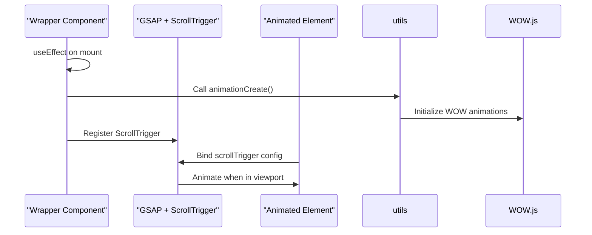

# Animations & Interactions

<cite>
**Referenced Files in This Document**  
- [useTitleAnimation.js](file://src/hooks/useTitleAnimation.js)
- [useCharAnimation.js](file://src/hooks/useCharAnimation.js)
- [wrapper.jsx](file://src/layout/wrapper.jsx)
- [hero-banner.jsx](file://src/common/hero-banner.jsx)
- [ContextProvider.js](file://src/context/ContextProvider.js)
- [useMultipleAnime.js](file://src/hooks/useMultipleAnime.js)
- [useBreadcrumbTitleAnime.js](file://src/hooks/useBreadcrumbTitleAnime.js)
- [utils.js](file://src/utils/utils.js)
- [hover-reveal.css](file://public/assets/css/hover-reveal.css)
</cite>

## Table of Contents
1. [GSAP Integration with React](#gsap-integration-with-react)
2. [Scroll-Triggered Animations](#scroll-triggered-animations)
3. [Hover-Reveal Effects](#hover-reveal-effects)
4. [Character-by-Character Text Animations](#character-by-character-text-animations)
5. [Staggered Element Reveals](#staggered-element-reveals)
6. [Animation Sequences in Hero Banner](#animation-sequences-in-hero-banner)
7. [Performance Optimization](#performance-optimization)
8. [Reduced Motion Fallbacks](#reduced-motion-fallbacks)

## GSAP Integration with React

The animation system leverages GSAP (GreenSock Animation Platform) integrated into React via custom hooks. These hooks abstract complex animation logic, enabling declarative usage across components. The integration relies on `useIsomorphicLayoutEffect` to ensure proper execution in both server and client environments, preventing hydration mismatches. Custom hooks such as `useTitleAnimation` and `useCharAnimation` encapsulate GSAP timelines and ScrollTrigger configurations, allowing consistent animation behavior with minimal boilerplate.

**Section sources**
- [useTitleAnimation.js](file://src/hooks/useTitleAnimation.js#L3-L17)
- [useCharAnimation.js](file://src/hooks/useCharAnimation.js#L4-L10)
- [useIsomorphicEffect.js](file://src/hooks/useIsomorphicEffect.js#L1-L3)

## Scroll-Triggered Animations

Scroll-triggered animations are initialized through GSAP’s ScrollTrigger plugin, registered globally in `wrapper.jsx`. This file serves as the root layout wrapper and ensures ScrollTrigger is available across the application. Upon component mount, a delayed call to `animationCreate()` initializes legacy WOW.js animations, while GSAP handles dynamic scroll-based effects. Elements are animated into view when they reach a specified position in the viewport, typically triggered at "top 90%" to create smooth, progressive reveals.

**Diagram sources**
- [wrapper.jsx](file://src/layout/wrapper.jsx#L1-L26)
- [utils.js](file://src/utils/utils.js#L1-L6)

**Section sources**
- [wrapper.jsx](file://src/layout/wrapper.jsx#L1-L26)
- [useTitleAnimation.js](file://src/hooks/useTitleAnimation.js#L3-L17)

## Hover-Reveal Effects

Hover-reveal effects are managed through a combination of React context and CSS classes. The `ContextProvider` exposes state and handlers for mouse enter/leave events, which components consume to toggle visual states. CSS classes defined in `hover-reveal.css` implement animated pseudo-elements (e.g., underlines, overlays) that respond to the `isEnter` state. Multiple animation effects (data-fx="1", "6", "14") support varied timing functions and directional reveals, enabling rich interactive feedback without JavaScript-driven animation logic.

**Section sources**
- [ContextProvider.js](file://src/context/ContextProvider.js#L4-L22)
- [hover-reveal.css](file://public/assets/css/hover-reveal.css#L1-L118)

## Character-by-Character Text Animations

The `useCharAnimation` hook enables character-by-character text animations by accepting a CSS selector or DOM reference. It applies a staggered animation sequence using GSAP’s timeline, where each character (or text segment) animates with a 0.3-second delay between elements. The animation includes vertical movement (`y: "0px"`) and opacity fade-in, creating a smooth typewriter-like effect. This hook is typically used for dynamic headlines or call-to-action text requiring high engagement.

**Section sources**
- [useCharAnimation.js](file://src/hooks/useCharAnimation.js#L4-L10)

## Staggered Element Reveals

Staggered reveals are implemented through the `useMultipleAnime` hook, which animates child elements of a container with incremental delays. Using `gsap.from()` with a stagger value of 0.25 seconds, each element enters from below (`y: '+100'`) with fading opacity. The animation is scroll-triggered, initiating when the container reaches 90% of the viewport height. This technique enhances visual hierarchy and guides user attention through content sections in a structured manner.

**Section sources**
- [useMultipleAnime.js](file://src/hooks/useMultipleAnime.js#L1-L27)

## Animation Sequences in Hero Banner

The `hero-banner.jsx` component implements a parallax-like text animation based on scroll position. It tracks `window.scrollY` using React state and applies a scaled vertical transform (`translateY`) to the title element. The effect creates an illusion of depth as the background remains static while the text moves at a slower rate (0.9x scroll speed). Although currently implemented with native scroll events, this could be enhanced with GSAP’s ScrollTrigger for smoother performance and better browser compatibility.

**Section sources**
- [hero-banner.jsx](file://src/common/hero-banner.jsx#L1-L38)

## Performance Optimization

The animation system incorporates several performance optimizations. Animations are initialized with a `setTimeout` delay in `wrapper.jsx` to avoid blocking initial render. The use of `useIsomorphicLayoutEffect` prevents server-client mismatches. Staggered and scroll-triggered animations are set up with minimal re-renders by relying on refs and effect dependencies. Additionally, GSAP’s efficient rendering engine minimizes layout thrashing by batching DOM updates.

However, the current implementation of `hero-banner.jsx` attaches a scroll event listener directly, which may cause performance issues on lower-end devices. Optimizations such as debouncing or using `IntersectionObserver` with GSAP could improve efficiency.

**Section sources**
- [wrapper.jsx](file://src/layout/wrapper.jsx#L1-L26)
- [hero-banner.jsx](file://src/common/hero-banner.jsx#L1-L38)
- [useIsomorphicEffect.js](file://src/hooks/useIsomorphicEffect.js#L1-L3)

## Reduced Motion Fallbacks

While the current codebase does not explicitly handle reduced motion preferences, GSAP supports integration with `prefers-reduced-motion` media queries. A recommended enhancement would be to detect user preferences via `window.matchMedia('(prefers-reduced-motion: reduce)')` and conditionally disable or simplify animations. This could be implemented within custom hooks to respect accessibility standards and improve user experience for those sensitive to motion.

**Section sources**
- [useTitleAnimation.js](file://src/hooks/useTitleAnimation.js#L3-L17)
- [useCharAnimation.js](file://src/hooks/useCharAnimation.js#L4-L10)