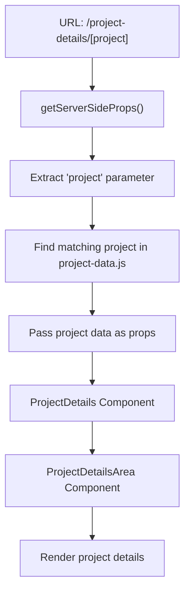

# Data Management

<cite>
**Referenced Files in This Document**   
- [service-data.js](file://src/data/service-data.js)
- [blog-data.js](file://src/data/blog-data.js)
- [project-data.js](file://src/data/project-data.js)
- [project-details-data.js](file://src/data/project-details-data.js)
- [service-details-data.js](file://src/data/service-details-data.js)
- [team-data.js](file://src/data/team-data.js)
- [testimonial-data.js](file://src/data/testimonial-data.js)
- [feature-data.js](file://src/data/feature-data.js)
- [portfolio-data.js](file://src/data/portfolio-data.js)
- [portfolio-blog.js](file://src/data/portfolio-blog.js)
- [price-data-1.js](file://src/data/price-data-1.js)
- [answer-question-data.js](file://src/data/answer-question-data.js)
- [testimonial-svg.js](file://src/data/testimonial-svg.js)
- [menu-data.js](file://src/layout/headers/menu-data.js)
- [\[project\].jsx](file://src/pages/project-details/[project].jsx)
- [project-details-area.jsx](file://src/components/project-details/project-details-area.jsx)
- [\[service\].jsx](file://src/pages/services/[service].jsx)
- [service-details-area.jsx](file://src/components/service-details/service-details-area.jsx)
</cite>

## Table of Contents
1. [Static Data Architecture Overview](#static-data-architecture-overview)
2. [Data File Structure and Consistency](#data-file-structure-and-consistency)
3. [Component Data Consumption Pattern](#component-data-consumption-pattern)
4. [Separation of Data Models and Presentation](#separation-of-data-models-and-presentation)
5. [Dynamic Routing and Data Mapping](#dynamic-routing-and-data-mapping)
6. [Content Update Workflow](#content-update-workflow)
7. [Localization Considerations](#localization-considerations)
8. [Performance Benefits in Next.js](#performance-benefits-in-nextjs)

## Static Data Architecture Overview

The application employs a static data architecture where all content is managed through JavaScript data files located in the `src/data` directory rather than relying on a Content Management System (CMS) or database. This approach centralizes content in easily accessible, version-controlled files such as `service-data.js`, `blog-data.js`, `project-data.js`, and specialized files like `project-details-data.js` and `service-details-data.js`. This architecture enables rapid content updates without requiring backend changes or database migrations, making it ideal for a Next.js application that prioritizes performance and simplicity. The static nature of these data files allows for efficient build-time processing and optimal client-side performance.

**Section sources**
- [service-data.js](file://src/data/service-data.js)
- [blog-data.js](file://src/data/blog-data.js)
- [project-data.js](file://src/data/project-data.js)
- [project-details-data.js](file://src/data/project-details-data.js)
- [service-details-data.js](file://src/data/service-details-data.js)

## Data File Structure and Consistency

All data files follow a consistent structure, organizing content as arrays of objects with standardized properties. For example, `service-data.js` exports an array of service objects, each containing properties such as `id`, `title`, `description`, `icon`, `img`, `delay`, and `key`. Similarly, `blog-data.js` structures blog entries with `id`, `img`, `category`, `date`, `title`, `author_img`, `author_name`, and `job_title`. The `project-data.js` file maintains consistency with `id`, `img_1`, `img_2`, `title`, `description`, `client_name`, `status`, and `delay`. This uniform structure across data files ensures predictable data consumption patterns and simplifies component development. The use of consistent property names enables reusable components that can render different types of content with minimal configuration.

**Section sources**
- [service-data.js](file://src/data/service-data.js#L1-L340)
- [blog-data.js](file://src/data/blog-data.js#L1-L80)
- [project-data.js](file://src/data/project-data.js#L1-L119)
- [team-data.js](file://src/data/team-data.js#L1-L49)
- [testimonial-data.js](file://src/data/testimonial-data.js#L1-L268)
- [feature-data.js](file://src/data/feature-data.js#L1-L45)

## Component Data Consumption Pattern

Components consume data through props passed from page-level components, establishing a clear data flow from the data files to the presentation layer. For instance, the `ProjectDetails` component in `src/components/project-details/index.jsx` receives a `project` prop from the `[project].jsx` page and uses it to find the corresponding project data from `project-data.js`. The component then passes relevant data to child components like `ProjectDetailsArea`. This pattern ensures that data logic remains separate from presentation logic, making components more reusable and easier to test. The use of dynamic imports and server-side props in Next.js pages enables efficient data loading and proper SEO handling while maintaining the separation between data retrieval and component rendering.

**Section sources**
- [\[project\].jsx](file://src/pages/project-details/[project].jsx)
- [project-details-area.jsx](file://src/components/project-details/project-details-area.jsx)
- [\[service\].jsx](file://src/pages/services/[service].jsx)
- [service-details-area.jsx](file://src/components/service-details/service-details-area.jsx)

## Separation of Data Models and Presentation

The architecture enforces a strict separation between data models and presentation components, allowing content updates without modifying UI code. Data files like `service-data.js` and `project-details-data.js` serve as pure data models, containing only content and metadata without any presentation logic. Presentation components such as `ProjectDetailsArea` and `ServiceDetailsArea` are responsible solely for rendering the data they receive through props. This separation enables non-technical content managers to update service descriptions, project details, or blog posts by simply modifying the appropriate data file without touching any component code. The decoupling also facilitates A/B testing and design iterations, as presentation components can be redesigned without affecting the underlying data structure.

**Section sources**
- [service-data.js](file://src/data/service-data.js)
- [project-details-data.js](file://src/data/project-details-data.js)
- [project-details-area.jsx](file://src/components/project-details/project-details-area.jsx)
- [service-details-area.jsx](file://src/components/service-details/service-details-area.jsx)

## Dynamic Routing and Data Mapping

The application leverages Next.js dynamic routing to map data files to specific routes, enabling scalable content management. The `[project].jsx` page in `src/pages/project-details/` uses dynamic routing to handle all project detail pages, with the route parameter determining which project data to display. The page component uses the `project` parameter to find the corresponding entry in `project-data.js` and `project-details-data.js`, creating a seamless mapping between URL paths and data objects. This approach eliminates the need for individual page files for each project, reducing code duplication and simplifying content management. The same pattern applies to service pages through `[service].jsx`, allowing new services to be added by simply updating the data files without creating new page components.

**Diagram sources**
- [\[project\].jsx](file://src/pages/project-details/[project].jsx)
- [project-data.js](file://src/data/project-data.js)
- [project-details-data.js](file://src/data/project-details-data.js)

**Section sources**
- [\[project\].jsx](file://src/pages/project-details/[project].jsx)
- [project-data.js](file://src/data/project-data.js)
- [project-details-data.js](file://src/data/project-details-data.js)

## Content Update Workflow

The content update workflow is streamlined and accessible, requiring only modifications to the relevant JavaScript data files. To update service information, content managers edit `service-data.js`, maintaining the existing object structure while updating text content, images, or metadata. For project details, updates are made directly to the corresponding entry in `project-details-data.js`, which uses a key-based structure where each project is accessed by its URL-friendly identifier. This flat file approach enables version control through Git, allowing for content change tracking, collaboration, and rollback capabilities. The workflow eliminates dependencies on database administrators or backend developers, empowering marketing and content teams to make updates independently while ensuring consistency through the predefined data structure.

**Section sources**
- [service-data.js](file://src/data/service-data.js)
- [project-details-data.js](file://src/data/project-details-data.js)
- [service-details-data.js](file://src/data/service-details-data.js)

## Localization Considerations

While the current implementation does not include built-in localization, the static data architecture provides a solid foundation for future internationalization. The separation of content from code makes it feasible to implement localization by creating language-specific data files (e.g., `service-data.en.js`, `service-data.sw.js`) or by adding language properties to existing data objects. The consistent structure of data files would allow for automated translation workflows and content synchronization across languages. For dynamic content like project and service details, a key-based approach (as seen in `project-details-data.js`) facilitates easy mapping of translated content to the appropriate routes. Future localization could leverage Next.js built-in i18n routing to serve different language versions while maintaining the same component structure.

**Section sources**
- [service-data.js](file://src/data/service-data.js)
- [project-details-data.js](file://src/data/project-details-data.js)
- [service-details-data.js](file://src/data/service-details-data.js)

## Performance Benefits in Next.js

The static data architecture delivers significant performance benefits in the Next.js environment. Since all content is stored in JavaScript files, it can be efficiently bundled and optimized during the build process, resulting in fast load times and improved Core Web Vitals. The use of static data enables server-side rendering (SSR) and static site generation (SSG) capabilities, allowing pages to be pre-rendered with their content, which improves SEO and perceived performance. Data files are imported directly into components, eliminating API calls and reducing latency associated with database queries or external content retrieval. The architecture also benefits from Next.js's code splitting, ensuring that only the necessary data is loaded for each page, minimizing bundle sizes and improving initial load performance.

**Section sources**
- [service-data.js](file://src/data/service-data.js)
- [blog-data.js](file://src/data/blog-data.js)
- [project-data.js](file://src/data/project-data.js)
- [\[project\].jsx](file://src/pages/project-details/[project].jsx)
- [\[service\].jsx](file://src/pages/services/[service].jsx)