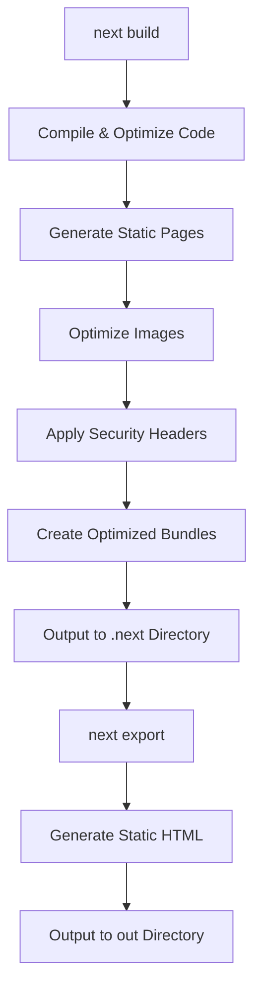
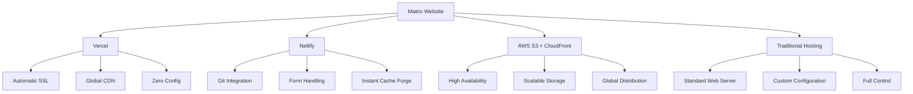
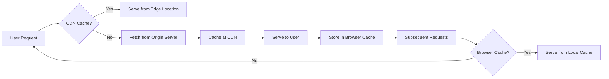

# Deployment

<cite>
**Referenced Files in This Document**   
- [next.config.js](file://next.config.js)
- [package.json](file://package.json)
- [README.md](file://README.md)
</cite>

## Table of Contents
1. [Production Build Process](#production-build-process)
2. [Next.js Configuration](#nextjs-configuration)
3. [Deployment Options](#deployment-options)
4. [Environment Configuration](#environment-configuration)
5. [Performance Optimization](#performance-optimization)
6. [Monitoring and Error Tracking](#monitoring-and-error-tracking)
7. [Rollback and Version Management](#rollback-and-version-management)

## Production Build Process

The Matrix website utilizes Next.js's optimized build process to generate production-ready assets. The build process is initiated using the `next build` command, which compiles and optimizes all application code, assets, and pages for production deployment. This process includes static site generation (SSG) for improved performance and SEO, with the ability to export fully static HTML files using the `next export` command.

The build process leverages SWC (Speedy Web Compiler) for minification, providing faster compilation times compared to traditional Babel transformations. During the build, Next.js automatically optimizes JavaScript bundles through tree shaking and code splitting, ensuring that only necessary code is included in each page's bundle. The configuration also enables scroll restoration, preserving user scroll position when navigating between pages.

For static export capabilities, the project includes a dedicated `export` script in package.json that runs `next export` after the build process. This generates a complete static version of the website in the `out` directory, making it suitable for deployment on any static hosting service without requiring a Node.js server.

**Section sources**
- [package.json](file://package.json#L10-L20)
- [next.config.js](file://next.config.js#L1-L10)

## Next.js Configuration

The `next.config.js` file contains comprehensive configuration for production deployment, including image optimization, security headers, and performance enhancements. The image optimization settings support modern formats like WebP and AVIF, with specified domains (`localhost` and `matrix.co.ke`) for remote image loading. The configuration defines device sizes and image sizes to ensure optimal image delivery across different screen resolutions.

Security is enhanced through custom HTTP headers configured in the `headers()` function, which sets X-Frame-Options to DENY, X-Content-Type-Options to nosniff, Referrer-Policy to origin-when-cross-origin, and X-XSS-Protection to 1; mode=block. These headers protect against common web vulnerabilities including clickjacking, MIME type sniffing, and cross-site scripting attacks.

The configuration also includes caching directives for static assets, setting a Cache-Control header with a one-year max-age and immutable directive for assets in the `/assets` directory. This ensures that static resources are efficiently cached by browsers and CDNs, reducing load times for returning visitors.

**Diagram sources**
- [next.config.js](file://next.config.js#L1-L102)
- [package.json](file://package.json#L15-L20)

**Section sources**
- [next.config.js](file://next.config.js#L1-L102)

## Deployment Options

The Matrix website can be deployed through multiple platforms, with Vercel being the recommended option as the official hosting platform for Next.js applications. Vercel provides zero-configuration deployment, automatic SSL, global CDN distribution, and instant cache invalidation. The platform automatically detects Next.js applications and optimizes the build and deployment process accordingly.

Netlify is another excellent option for deployment, particularly suitable for the static export version of the website. Netlify offers continuous deployment from Git repositories, instant cache purging, and built-in form handling. The static export capability makes the website compatible with traditional hosting providers such as AWS S3 with CloudFront, Google Cloud Storage, or any standard web server.

For Vercel deployment, the project requires no additional configuration beyond connecting the Git repository. For Netlify, a `netlify.toml` configuration file can be added to specify build settings, though the default settings typically suffice. Traditional hosting requires uploading the contents of the `out` directory generated by `next export` to the web server.

**Diagram sources**
- [README.md](file://README.md#L210-L230)
- [package.json](file://package.json#L15-L20)

**Section sources**
- [README.md](file://README.md#L210-L230)

## Environment Configuration

Environment-specific configurations are managed through Next.js environment variables, with public variables prefixed with `NEXT_PUBLIC_` to make them available in the browser. The configuration includes a custom key in the `env` object, which can be used to store environment-specific values. For production deployment, environment variables should be configured in the hosting platform's settings rather than in local files.

Custom domains are configured through the hosting platform's domain management interface. For Vercel, domains are added through the project settings, with automatic SSL certificate provisioning via Let's Encrypt. DNS records must be updated to point to the hosting provider's servers, typically requiring A records or CNAME records depending on the domain registrar and hosting platform.

SSL/TLS encryption is automatically handled by modern hosting platforms like Vercel and Netlify, which provide free SSL certificates and enforce HTTPS by default. For traditional hosting, SSL certificates must be obtained and configured on the web server, with HTTP requests redirected to HTTPS to ensure secure connections.

**Section sources**
- [next.config.js](file://next.config.js#L85-L90)
- [README.md](file://README.md#L170-L180)

## Performance Optimization

Post-deployment performance optimization focuses on caching strategies and CDN integration to maximize loading speed and user experience. The configuration already includes aggressive caching for static assets through the Cache-Control header with a one-year max-age and immutable directive, ensuring that browsers and intermediate caches store these resources long-term.

CDN integration is automatic when using platforms like Vercel or Netlify, which have global CDN networks built into their infrastructure. For traditional hosting, a CDN service like Cloudflare, Amazon CloudFront, or Akamai should be implemented to cache content at edge locations worldwide, reducing latency for international visitors.

Additional performance optimizations include code splitting to reduce initial load time, lazy loading of non-critical resources, and preloading key assets. The Webpack configuration in `next.config.js` includes vendor chunk splitting, which separates third-party library code from application code, allowing for better caching as vendor code typically changes less frequently than application code.

**Diagram sources**
- [next.config.js](file://next.config.js#L65-L75)
- [README.md](file://README.md#L50-L60)

**Section sources**
- [next.config.js](file://next.config.js#L65-L75)

## Monitoring and Error Tracking

Monitoring and error tracking setup is essential for maintaining website reliability and quickly addressing issues. While the current configuration doesn't include specific monitoring tools, best practices recommend implementing error tracking services like Sentry, LogRocket, or Vercel's built-in analytics for production environments.

Error boundaries are implemented in the application through the `ErrorBoundary` component in `src/components/common/ErrorBoundary.jsx`, providing graceful error handling for React components. This prevents the entire application from crashing when a component fails, instead displaying a fallback UI while logging the error for investigation.

For comprehensive monitoring, additional services should be integrated to track performance metrics, error rates, and user behavior. This includes setting up Google Analytics or similar tools for user tracking, implementing uptime monitoring services to alert of outages, and configuring log aggregation for server-side errors when using server-side rendering or API routes.

**Section sources**
- [src/components/common/ErrorBoundary.jsx](file://src/components/common/ErrorBoundary.jsx)
- [next.config.js](file://next.config.js#L1-L10)

## Rollback and Version Management

Rollback procedures and version management best practices ensure reliable production updates. Hosting platforms like Vercel and Netlify provide built-in version control and rollback capabilities, allowing instant reversion to previous deployments if issues are detected after an update.

The deployment process should follow a structured approach: first deploying to a staging environment for testing, then to production with monitoring enabled. Automated testing should be implemented in the CI/CD pipeline to catch issues before deployment. For critical updates, a blue-green deployment strategy can be used, where the new version is deployed alongside the old version and traffic is gradually shifted after verification.

Version management should include proper Git branching strategies, with feature branches merged to a main branch only after code review and testing. Each deployment should be tagged with a version number or Git commit hash for easy identification and rollback. Deployment logs should be maintained to track when changes were made and by whom, facilitating incident investigation and accountability.

**Section sources**
- [README.md](file://README.md#L190-L200)
- [package.json](file://package.json#L10-L20)