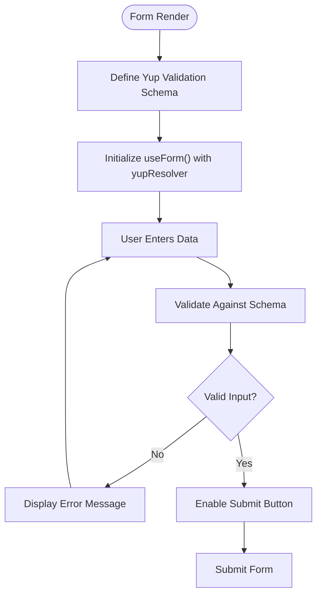
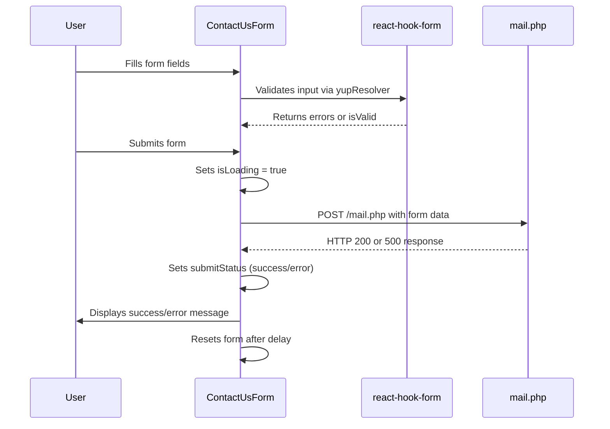

# Forms & Validation

<cite>
**Referenced Files in This Document**   
- [contact-us-form.jsx](file://src/forms/contact-us-form.jsx)
- [register-form.jsx](file://src/forms/register-form.jsx)
- [formUtils.js](file://src/utils/formUtils.js)
- [mail.php](file://public/assets/mail.php)
</cite>

## Table of Contents
1. [Introduction](#introduction)
2. [Form Implementation with React Hook Form](#form-implementation-with-react-hook-form)
3. [Validation with Yup](#validation-with-yup)
4. [Form Components Structure](#form-components-structure)
5. [Form Submission Workflow](#form-submission-workflow)
6. [Validation Rules and Error Handling](#validation-rules-and-error-handling)
7. [Backend Integration via mail.php](#backend-integration-via-mailphp)
8. [Security Considerations](#security-considerations)
9. [Accessibility and User Feedback](#accessibility-and-user-feedback)
10. [Conclusion](#conclusion)

## Introduction
This document provides a comprehensive overview of the form implementation and validation system used in the Matrix website. It details the integration of `react-hook-form` for efficient state management and `Yup` for schema-based validation, along with backend processing through `mail.php`. The analysis covers form components, validation logic, error handling, security practices, and accessibility features.

**Section sources**
- [contact-us-form.jsx](file://src/forms/contact-us-form.jsx#L1-L244)
- [register-form.jsx](file://src/forms/register-form.jsx#L1-L133)

## Form Implementation with React Hook Form
The project leverages `react-hook-form` to manage form state efficiently, minimizing re-renders and improving performance. This library enables uncontrolled inputs with minimal boilerplate, allowing direct DOM manipulation while maintaining validation and error tracking.

Key features implemented:
- Centralized form state via `useForm()` hook
- Dynamic field registration using `register()`
- Real-time validation through `formState` (errors, touched fields, validity)
- Submission handling with `handleSubmit()`
- Reset functionality after successful submission

Forms such as Contact Us and Register utilize this pattern to streamline user input processing and enhance responsiveness.

**Section sources**
- [contact-us-form.jsx](file://src/forms/contact-us-form.jsx#L28-L75)
- [register-form.jsx](file://src/forms/register-form.jsx#L15-L25)

## Validation with Yup
Validation is implemented using `Yup`, a JavaScript schema builder for value parsing and validation. Each form defines a validation schema that specifies required fields, data types, and constraints.

For example:
- The Contact Us form enforces minimum character lengths, valid email format, and phone number patterns.
- The Register form requires a password of at least six characters and valid email syntax.

These schemas are integrated with `react-hook-form` via `yupResolver`, enabling seamless client-side validation before submission.

**Diagram sources**
- [contact-us-form.jsx](file://src/forms/contact-us-form.jsx#L7-L25)
- [register-form.jsx](file://src/forms/register-form.jsx#L7-L13)

## Form Components Structure
The application organizes form components under the `src/forms/` directory. Two primary forms are analyzed:

### Contact Us Form
Located at `contact-us-form.jsx`, this component includes:
- Full name, email, phone, service selection, and message fields
- Integration with `NiceSelect` for dropdown functionality
- Loading and submission status indicators
- Accessibility attributes (ARIA labels, error descriptions)

### Register Form
Found in `register-form.jsx`, it features:
- Full name, email, and password inputs
- Password visibility toggle using EyeOn/EyeOff SVG icons
- Checkbox for "Remember me" and link for password recovery
- Inline error display below each field

Both components follow a consistent structure using floating labels and dynamic CSS classes for visual feedback.

**Section sources**
- [contact-us-form.jsx](file://src/forms/contact-us-form.jsx#L1-L244)
- [register-form.jsx](file://src/forms/register-form.jsx#L1-L133)

## Form Submission Workflow
The form submission process follows a structured flow from user interaction to server response:

1. User fills out the form fields.
2. Client-side validation occurs on change or blur events.
3. Upon valid input, the user submits the form.
4. The `onSubmit` handler triggers, setting a loading state.
5. Data is either passed to a prop function (`onSubmitProp`) or logged locally.
6. Success or error status is displayed temporarily.
7. Form resets upon success.

This workflow ensures a smooth user experience with immediate feedback and prevents invalid submissions.

**Diagram sources**
- [contact-us-form.jsx](file://src/forms/contact-us-form.jsx#L76-L112)
- [mail.php](file://public/assets/mail.php#L1-L112)

## Validation Rules and Error Handling
Validation rules are defined within Yup schemas and applied consistently across forms:

| Field | Validation Rule | Error Message |
|-------|------------------|-------------|
| Full Name | Required, min 2 characters | "Full name is required", "Name must be at least 2 characters" |
| Email | Required, valid format | "Email is required", "Please enter a valid email address" |
| Phone | Required, matches pattern | "Phone number is required", "Please enter a valid phone number" |
| Message | Required, min 10 characters | "Message is required", "Message must be at least 10 characters" |
| Password | Required, min 6 characters | Built-in Yup message |

Error states are visually indicated by:
- Red border (`error` class) on invalid inputs
- Floating error messages with ARIA alerts
- Disabled submit button during loading

Utility functions in `formUtils.js` support additional validation logic and formatting.

**Section sources**
- [contact-us-form.jsx](file://src/forms/contact-us-form.jsx#L7-L25)
- [formUtils.js](file://src/utils/formUtils.js#L1-L20)

## Backend Integration via mail.php
Form data is processed server-side by `mail.php`, which handles email transmission:

- Accepts only POST requests
- Sanitizes input using `strip_tags()` and `filter_var()`
- Validates required fields and email format
- Constructs plain-text email with sender details and message
- Uses PHP’s `mail()` function to send the message
- Returns appropriate HTTP status codes (200, 400, 500)

The script sends emails to a predefined recipient and provides user feedback based on delivery success.

**Section sources**
- [mail.php](file://public/assets/mail.php#L1-L112)

## Security Considerations
The implementation includes several security measures:

- **Input Sanitization**: `strip_tags()` removes HTML/PHP tags from name input; `FILTER_SANITIZE_EMAIL` cleans email input.
- **Email Injection Prevention**: By avoiding direct use of user-provided headers and constructing the `From` header safely, the risk of header injection is mitigated.
- **CSRF Protection**: While not explicitly implemented, the lack of authentication or session-dependent actions reduces CSRF risk.
- **Data Validation**: Both client and server validate email format and required fields to prevent malformed submissions.

Despite these efforts, the use of PHP’s `mail()` function without SMTP authentication may expose the system to spam filtering issues or delivery failures.

**Section sources**
- [mail.php](file://public/assets/mail.php#L1-L112)

## Accessibility and User Feedback
The forms prioritize accessibility and user experience:

- **ARIA Attributes**: Labels, error messages, and loading states are announced by screen readers using `aria-label`, `aria-describedby`, and `role="alert"`.
- **Keyboard Navigation**: All form controls are focusable and operable via keyboard.
- **Visual Feedback**: Success and error messages appear inline with icons and clear text, auto-dismissing after a few seconds.
- **Loading States**: During submission, a spinner and disabled button prevent duplicate submissions.
- **Color Contrast**: Error messages use high-contrast styling for visibility.

These features ensure the forms are usable by individuals with disabilities and provide intuitive interaction for all users.

**Section sources**
- [contact-us-form.jsx](file://src/forms/contact-us-form.jsx#L113-L243)

## Conclusion
The Matrix website employs a robust form system using `react-hook-form` and `Yup` for efficient client-side management and validation. Forms are well-structured, accessible, and integrated with a PHP backend for email delivery. While basic security practices are followed, enhancements such as CSRF tokens, rate limiting, and SMTP-based email sending could further improve reliability and protection. Overall, the implementation balances functionality, usability, and maintainability.