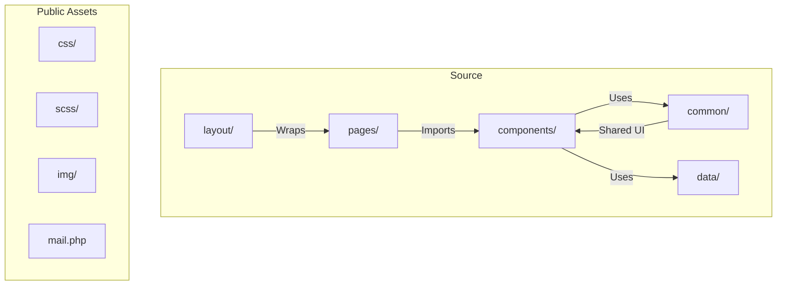
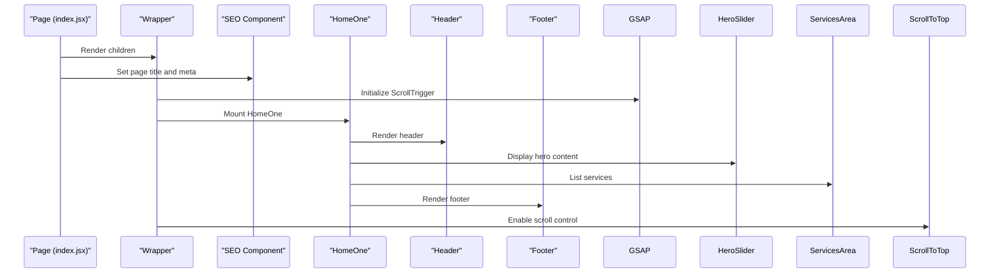
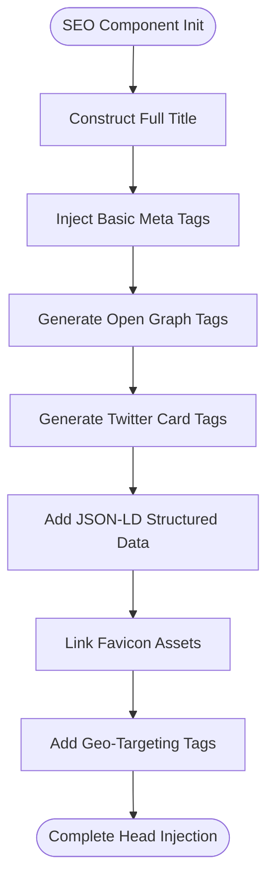
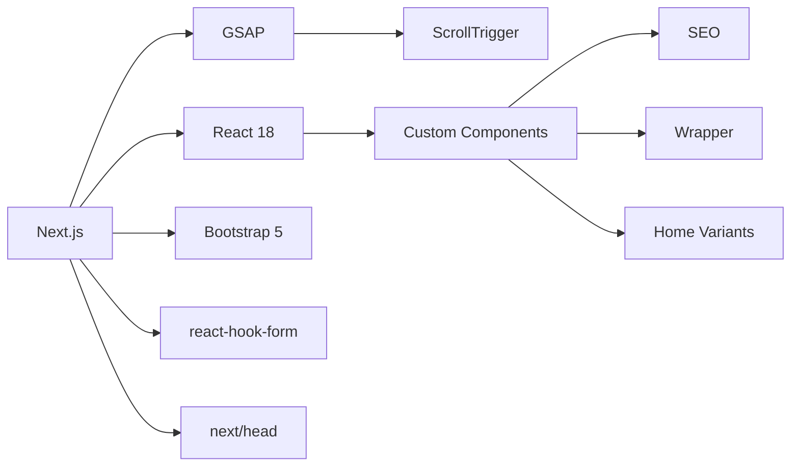

# Project Overview

<cite>
**Referenced Files in This Document**   
- [index.jsx](file://src/pages/index.jsx)
- [home-2.jsx](file://src/pages/home-2.jsx)
- [home-3.jsx](file://src/pages/home-3.jsx)
- [home-4.jsx](file://src/pages/home-4.jsx)
- [home-5.jsx](file://src/pages/home-5.jsx)
- [wrapper.jsx](file://src/layout/wrapper.jsx)
- [seo.jsx](file://src/common/seo.jsx)
- [home/index.jsx](file://src/components/homes/home/index.jsx)
- [home-2/index.jsx](file://src/components/homes/home-2/index.jsx)
- [home-3/index.jsx](file://src/components/homes/home-3/index.jsx)
- [home-4/index.jsx](file://src/components/homes/home-4/index.jsx)
- [home-5/index.jsx](file://src/components/homes/home-5/index.jsx)
</cite>

## Table of Contents
1. [Introduction](#introduction)
2. [Project Structure](#project-structure)
3. [Core Components](#core-components)
4. [Architecture Overview](#architecture-overview)
5. [Detailed Component Analysis](#detailed-component-analysis)
6. [Dependency Analysis](#dependency-analysis)
7. [Performance Considerations](#performance-considerations)
8. [Troubleshooting Guide](#troubleshooting-guide)
9. [Conclusion](#conclusion)

## Introduction
The Matrix Vision Systems website serves as a professional business frontend for an IT solutions company based in Kenya, specializing in infrastructure development, enterprise software, cybersecurity, and digital transformation services across East Africa. The site is designed to showcase the company's portfolio, services, team, and client success stories while enabling lead generation through contact forms and service inquiries. Built using modern web technologies including Next.js 13.4+, React 18, and Bootstrap 5, the website emphasizes component-based architecture, static content delivery, and SEO optimization. Multiple homepage variations (home-2 through home-5) demonstrate flexible UI composition tailored for different service lines or branding strategies, all unified under a consistent layout and navigation system.

**Section sources**
- [index.jsx](file://src/pages/index.jsx)
- [seo.jsx](file://src/common/seo.jsx)

## Project Structure
The project follows a modular and scalable directory structure optimized for maintainability and feature separation. The `src` directory contains all application logic, organized into logical subdirectories: `components` for reusable UI elements, `pages` for route-based views, `layout` for structural wrappers, `common` for shared components, and `data` for static content. The `public/assets` folder houses static resources including CSS, SCSS, images, and PHP scripts for backend handling. The use of Next.js enables file-based routing, with dynamic routes implemented via bracketed filenames (e.g., `[project].jsx`). Each homepage variant resides in its own subdirectory under `components/homes`, promoting isolation and reusability.



**Diagram sources**
- [src/pages/index.jsx](file://src/pages/index.jsx)
- [src/components/homes/home/index.jsx](file://src/components/homes/home/index.jsx)

**Section sources**
- [src/pages/index.jsx](file://src/pages/index.jsx)
- [src/components/homes/home/index.jsx](file://src/components/homes/home/index.jsx)

## Core Components
The website's functionality is driven by a set of core components that define layout, SEO, and user interaction. The `Wrapper` component initializes global animations using GSAP and ScrollTrigger, ensuring smooth scrolling and entrance effects across pages. The `SEO` component injects comprehensive metadata including Open Graph tags, Twitter cards, structured data (JSON-LD), and geo-targeting for Kenya, enhancing search visibility and social sharing. Each homepage variant (e.g., `HomeOne`, `HomeTwo`) composes unique sections such as hero banners, service areas, testimonials, and pricing, demonstrating a flexible yet consistent design system. These components are orchestrated through page-level routing in the `pages` directory, where each `.jsx` file imports its corresponding home layout and wraps it with SEO and layout providers.

**Section sources**
- [wrapper.jsx](file://src/layout/wrapper.jsx)
- [seo.jsx](file://src/common/seo.jsx)
- [index.jsx](file://src/pages/index.jsx)

## Architecture Overview
The Matrix Vision Systems website is built on a modern React-based stack using Next.js 13.4+ and React 18, leveraging Server-Side Rendering (SSR) and Static Site Generation (SSG) for optimal performance and SEO. The architecture follows a component-driven design pattern, where UI elements are encapsulated into reusable, composable modules. The `Wrapper` component acts as a global provider for animation initialization via GSAP, while the `ContextProvider` supports state management for interactive features. Bootstrap 5 utilities are used for responsive layout, enhanced with custom SCSS modules for theming, animations, and breakpoints. The `_app.jsx` and `_document.jsx` files in the `pages` directory serve as entry points, enabling persistent layout and custom document structure across routes.

```mermaid
graph TD
A[Next.js App] --> B[_app.jsx)
A --> C[_document.jsx)
B --> D[Wrapper]
D --> E[GSAP Animation Init]
B --> F[SEO Component]
F --> G[Meta Tags)
F --> H[Open Graph)
F --> I[Twitter Card)
F --> J[Structured Data)
B --> K[Page Routing)
K --> L[Home Variants)
L --> M[HomeOne]
L --> N[HomeTwo]
L --> O[HomeThree]
L --> P[HomeFour]
L --> Q[HomeFive]
```

**Diagram sources**
- [wrapper.jsx](file://src/layout/wrapper.jsx)
- [seo.jsx](file://src/common/seo.jsx)
- [index.jsx](file://src/pages/index.jsx)

## Detailed Component Analysis

### Homepage Composition and Layout
The website implements five distinct homepage layouts (`home-1` through `home-5`), each tailored for different branding or service focus areas. The primary homepage (`index.jsx`) uses `HomeOne`, which includes a hero slider, services, projects, and testimonials. `HomeTwo` emphasizes payment and account features, suggesting a fintech or SaaS orientation. `HomeThree` highlights analytics and integration capabilities, while `HomeFour` focuses on security, team, and platform features. `HomeFive` introduces video content and business solutions, indicating a high-end corporate presentation. Despite visual differences, all homepages share a common structural foundation: they are wrapped in `Wrapper`, include `SEO`, and use header/footer pairs specific to their design (e.g., `HeaderTwo` with `FooterTwo`).

#### For API/Service Components:


**Diagram sources**
- [index.jsx](file://src/pages/index.jsx)
- [wrapper.jsx](file://src/layout/wrapper.jsx)
- [home/index.jsx](file://src/components/homes/home/index.jsx)

**Section sources**
- [index.jsx](file://src/pages/index.jsx)
- [home/index.jsx](file://src/components/homes/home/index.jsx)

### SEO and Metadata Implementation
The `SEO` component is central to the site's discoverability, injecting a comprehensive set of meta tags for search engines and social platforms. It dynamically constructs page titles, Open Graph metadata, and Twitter cards, with default values for description, keywords, and authorship. The component also includes structured data in JSON-LD format, defining the organization schema with contact details, address, and social profiles. Geo-targeting meta tags specify Kenya as the primary region, enhancing local search relevance. The inclusion of canonical URLs, robots directives, and favicon links ensures compliance with SEO best practices.

#### For Complex Logic Components:


**Diagram sources**
- [seo.jsx](file://src/common/seo.jsx)

**Section sources**
- [seo.jsx](file://src/common/seo.jsx)

## Dependency Analysis
The application relies on a combination of core libraries and utility packages to deliver its functionality. Next.js provides the foundational framework for routing, SSR, and static generation. React 18 enables concurrent rendering and hooks-based state management. GSAP powers advanced animations and scroll effects, with ScrollTrigger enabling scroll-based sequencing. Bootstrap 5 delivers responsive grid and component utilities, extended with custom SCSS for theming and layout. The project uses `react-hook-form` for form validation (inferred from form components), and `next/head` for document head management. All dependencies are managed via `package.json`, with no external API integrations evident from the current structure.



**Diagram sources**
- [package.json](file://package.json)
- [wrapper.jsx](file://src/layout/wrapper.jsx)
- [seo.jsx](file://src/common/seo.jsx)

**Section sources**
- [package.json](file://package.json)
- [wrapper.jsx](file://src/layout/wrapper.jsx)

## Performance Considerations
The website incorporates several performance optimization techniques. Image optimization is implied through the use of static assets and likely handled via Next.js Image component (inferred from `OptimizedImage` in components). Critical CSS is inlined through the SCSS build process, with modular styles organized under `utils` and `components`. The use of static generation and SSR improves Time to First Byte (TTFB) and SEO. GSAP animations are initialized with a timeout to prevent blocking the main thread, and scroll-based triggers are registered only after component mount. The inclusion of a preloader (inferred from `preloader.jsx`) suggests a strategy for masking initial load time, especially for animation-heavy pages.

**Section sources**
- [wrapper.jsx](file://src/layout/wrapper.jsx)
- [public/assets/scss/main.scss](file://public/assets/scss/main.scss)

## Troubleshooting Guide
Common issues may arise from animation initialization delays due to the `setTimeout` in `Wrapper`, which could cause flickering if content loads faster than 100ms. Developers should ensure that all GSAP dependencies are properly registered. SEO misconfigurations may occur if `pageTitle` is not passed correctly to the `SEO` component, leading to duplicate or missing titles. The use of absolute paths (`/assets/`) for images requires consistent deployment configuration to avoid broken links. Form submissions rely on `mail.php`, which must be correctly configured on the server to handle POST requests and prevent spam.

**Section sources**
- [wrapper.jsx](file://src/layout/wrapper.jsx)
- [seo.jsx](file://src/common/seo.jsx)
- [mail.php](file://public/assets/mail.php)

## Conclusion
The Matrix Vision Systems website exemplifies a modern, component-driven frontend architecture built on Next.js and React, tailored for an IT solutions provider in Kenya. Its flexible homepage system allows for diverse service presentations while maintaining brand consistency. The integration of GSAP for animations, comprehensive SEO practices, and performance-focused design patterns demonstrate a high level of technical sophistication. The codebase is well-structured, modular, and scalable, supporting both beginner onboarding through clear component organization and advanced customization via SCSS and React hooks.