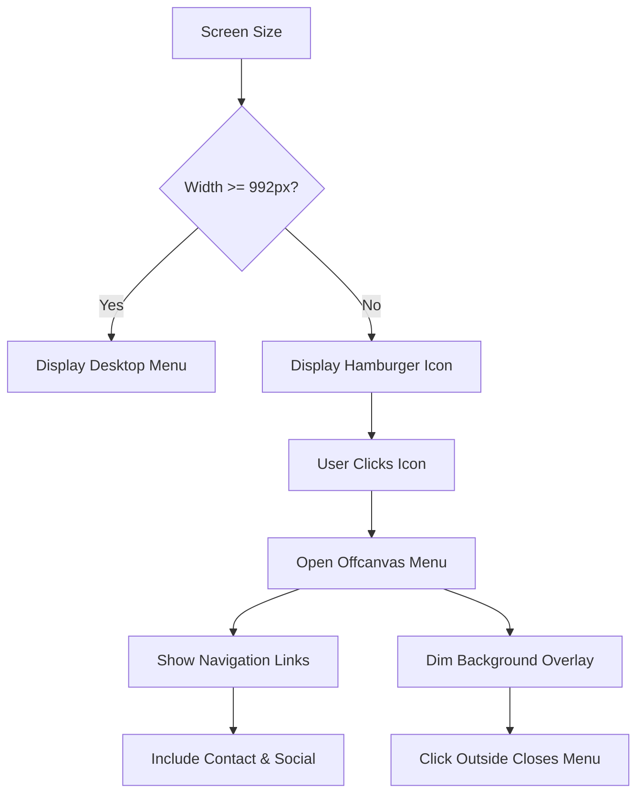
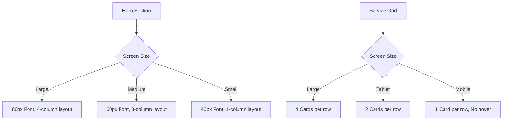

# Responsive Design

<cite>
**Referenced Files in This Document**   
- [header.jsx](file://src/layout/headers/header.jsx)
- [nav-menu.jsx](file://src/layout/headers/nav-menu.jsx)
- [menu-data.js](file://src/layout/headers/menu-data.js)
- [offcanvus.jsx](file://src/common/offcanvus.jsx)
- [_breakpoints.scss](file://public/assets/scss/utils/_breakpoints.scss)
- [_meanmenu.scss](file://public/assets/scss/components/_meanmenu.scss)
- [_header.scss](file://public/assets/scss/layout/_header.scss)
- [_footer.scss](file://public/assets/scss/layout/_footer.scss)
- [_offcanvas.scss](file://public/assets/scss/components/_offcanvas.scss)
- [_hero.scss](file://public/assets/scss/layout/_hero.scss)
- [_service.scss](file://public/assets/scss/layout/_service.scss)
</cite>

## Table of Contents
1. [Mobile-First Approach and Breakpoint Strategy](#mobile-first-approach-and-breakpoint-strategy)
2. [Responsive Navigation Patterns](#responsive-navigation-patterns)
3. [Adaptive Layout Components](#adaptive-layout-components)
4. [Utility Classes for Responsive Spacing and Visibility](#utility-classes-for-responsive-spacing-and-visibility)
5. [Component-Level Responsiveness](#component-level-responsiveness)
6. [Touch-Friendly Interactions and Viewport Scaling](#touch-friendly-interactions-and-viewport-scaling)
7. [Testing Methodologies and Usability Across Devices](#testing-methodologies-and-usability-across-devices)

## Mobile-First Approach and Breakpoint Strategy

The website implements a mobile-first responsive design strategy using a combination of Bootstrap 5's grid system and custom SCSS breakpoints defined in `_breakpoints.scss`. The design prioritizes mobile rendering and progressively enhances the layout for larger screens through media queries. The custom breakpoints are defined as: extra-small (`$xs`) for screens up to 767px, medium (`$md`) from 768px to 991px, large (`$lg`) from 992px to 1199px, extra-large (`$xl`) from 1200px to 1399px, and two additional breakpoints for wider screens (`$xxl` and `$xxxl`). This granular control allows for precise layout adjustments across a wide range of device sizes, ensuring optimal presentation from smartphones to large desktop monitors.

**Section sources**
- [public/assets/scss/utils/_breakpoints.scss](file://public/assets/scss/utils/_breakpoints.scss#L1-L13)

## Responsive Navigation Patterns

The navigation system adapts to screen size through a dual-pattern approach: desktop menus and mobile offcanvas navigation. On desktop and larger tablet screens, the primary navigation appears as a horizontal menu in the header, implemented through the `NavMenu` component which dynamically generates links from `menu-data.js`. This menu supports dropdowns and mega-menus for complex service categories. On mobile devices (below 992px), the navigation transforms into an offcanvas menu powered by the MeanMenu library. The hamburger icon triggers the `Offcanvus` component, which slides in from the right with a full-screen menu overlay. This pattern ensures accessibility and usability on touch devices while conserving screen real estate. The offcanvas menu includes not only navigation links but also contact information and social media links, providing a comprehensive mobile experience.

**Diagram sources**
- [src/layout/headers/header.jsx](file://src/layout/headers/header.jsx#L1-L109)
- [src/common/offcanvus.jsx](file://src/common/offcanvus.jsx#L1-L50)
- [public/assets/scss/components/_meanmenu.scss](file://public/assets/scss/components/_meanmenu.scss#L1-L135)
- [public/assets/scss/components/_offcanvas.scss](file://public/assets/scss/components/_offcanvas.scss#L1-L200)

**Section sources**
- [src/layout/headers/header.jsx](file://src/layout/headers/header.jsx#L1-L109)
- [src/layout/headers/nav-menu.jsx](file://src/layout/headers/nav-menu.jsx#L1-L29)
- [src/layout/headers/menu-data.js](file://src/layout/headers/menu-data.js#L1-L195)
- [src/common/offcanvus.jsx](file://src/common/offcanvus.jsx#L1-L50)

## Adaptive Layout Components

Key layout components such as headers and footers are designed to adapt seamlessly across screen sizes. The header uses a sticky positioning strategy that activates on scroll, with different visual treatments for various screen sizes. On mobile, the header collapses to conserve space, hiding non-essential elements and relying on the offcanvas menu. The footer implements a multi-column layout on desktop that reflows into a single column on mobile, with padding and spacing adjusted through media queries in `_footer.scss`. Both components use conditional classes and responsive utility classes to modify their appearance, ensuring readability and usability on small screens while maintaining visual impact on larger displays.

**Section sources**
- [public/assets/scss/layout/_header.scss](file://public/assets/scss/layout/_header.scss#L1-L799)
- [public/assets/scss/layout/_footer.scss](file://public/assets/scss/layout/_footer.scss#L1-L955)

## Utility Classes for Responsive Spacing and Visibility

The design leverages a comprehensive system of utility classes for responsive spacing and element visibility. These classes, defined in various SCSS partials, allow for granular control over margins, padding, and display properties based on screen size. For example, the header uses classes like `d-none d-md-block` to hide the top bar on mobile and show it on medium screens and up. Spacing is managed through responsive padding and margin classes that adjust values at different breakpoints, such as `header-mob-space` which applies different padding on mobile versus desktop. This utility-first approach enables precise layout control without writing custom CSS for each component, promoting consistency and maintainability across the codebase.

**Section sources**
- [public/assets/scss/layout/_header.scss](file://public/assets/scss/layout/_header.scss#L1-L799)
- [public/assets/scss/layout/_footer.scss](file://public/assets/scss/layout/_footer.scss#L1-L955)
- [public/assets/scss/components/_spacing.scss](file://public/assets/scss/components/_spacing.scss)

## Component-Level Responsiveness

Individual components such as hero sections and service grids demonstrate sophisticated responsiveness. The hero section uses fluid typography and responsive image positioning, with font sizes scaling from 80px on desktop to 40px on mobile. The layout reflows to accommodate different screen widths, with background shapes and decorative elements repositioned through media queries. Service grids implement a flexible card-based layout that transitions from four columns on desktop to a single column on mobile, with hover effects disabled on touch devices to prevent conflicts. These components use a combination of CSS Grid, Flexbox, and absolute positioning to create dynamic layouts that maintain visual hierarchy and content priority across all devices.

**Diagram sources**
- [public/assets/scss/layout/_hero.scss](file://public/assets/scss/layout/_hero.scss#L1-L1212)
- [public/assets/scss/layout/_service.scss](file://public/assets/scss/layout/_service.scss#L1-L1127)

**Section sources**
- [public/assets/scss/layout/_hero.scss](file://public/assets/scss/layout/_hero.scss#L1-L1212)
- [public/assets/scss/layout/_service.scss](file://public/assets/scss/layout/_service.scss#L1-L1127)

## Touch-Friendly Interactions and Viewport Scaling

The design prioritizes touch-friendly interactions, particularly on mobile devices. Interactive elements such as navigation links, buttons, and form controls are sized appropriately for touch input, with sufficient spacing to prevent mis-taps. The offcanvas menu uses a large close button and body overlay that can be tapped to dismiss the menu, providing multiple ways to close the interface. Viewport scaling is managed through the meta viewport tag, ensuring proper rendering on mobile devices. Hover effects are selectively applied, with JavaScript detection potentially used to disable hover states on touch devices, preventing usability issues. The overall touch target size adheres to accessibility guidelines, making the site usable for all users regardless of input method.

**Section sources**
- [src/common/offcanvus.jsx](file://src/common/offcanvus.jsx#L1-L50)
- [public/assets/scss/components/_offcanvas.scss](file://public/assets/scss/components/_offcanvas.scss#L1-L200)

## Testing Methodologies and Usability Across Devices

The responsive design is validated through comprehensive testing methodologies that ensure usability across device sizes. The implementation uses a mobile-first approach with progressive enhancement, testing each breakpoint to verify layout integrity and functionality. The design maintains usability on small screens by prioritizing content, simplifying navigation, and optimizing touch interactions, while providing rich visual experiences on desktop through animations, hover effects, and complex layouts. Cross-browser testing ensures consistent rendering, and performance optimization techniques are employed to maintain fast load times on mobile networks. The result is a responsive website that delivers an optimal user experience regardless of the device being used.

**Section sources**
- [public/assets/scss/utils/_breakpoints.scss](file://public/assets/scss/utils/_breakpoints.scss#L1-L13)
- [src/layout/headers/header.jsx](file://src/layout/headers/header.jsx#L1-L109)
- [src/common/offcanvus.jsx](file://src/common/offcanvus.jsx#L1-L50)