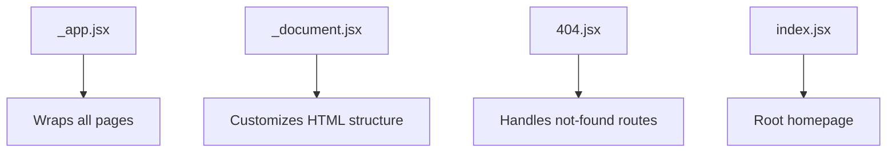
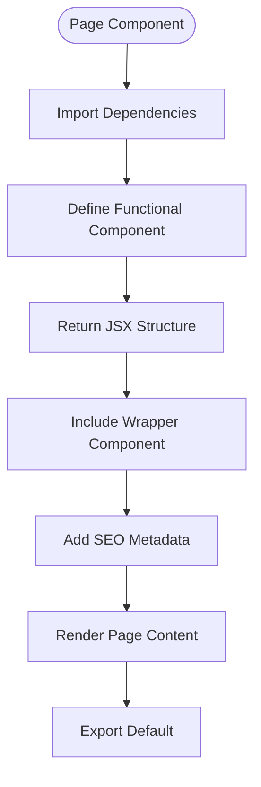
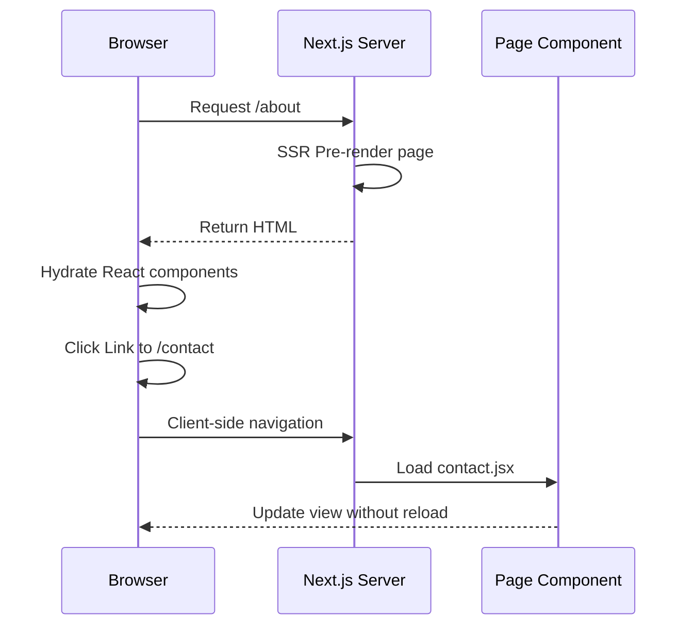

# Page Routing Structure

<cite>
**Referenced Files in This Document**   
- [src/pages/_app.jsx](file://src/pages/_app.jsx)
- [src/pages/_document.jsx](file://src/pages/_document.jsx)
- [src/pages/index.jsx](file://src/pages/index.jsx)
- [src/pages/about.jsx](file://src/pages/about.jsx)
- [src/pages/contact.jsx](file://src/pages/contact.jsx)
- [src/pages/404.jsx](file://src/pages/404.jsx)
- [src/layout/wrapper.jsx](file://src/layout/wrapper.jsx)
- [src/common/seo.jsx](file://src/common/seo.jsx)
</cite>

## Table of Contents
1. [Introduction](#introduction)
2. [File-Based Routing System](#file-based-routing-system)
3. [Special Pages and Files](#special-pages-and-files)
4. [Page Component Structure](#page-component-structure)
5. [Route to File Path Mapping](#route-to-file-path-mapping)
6. [Client-Side and Server-Side Rendering](#client-side-and-server-side-rendering)
7. [Layout and Global State Management](#layout-and-global-state-management)
8. [Best Practices for Static Page Organization](#best-practices-for-static-page-organization)

## Introduction
This document provides a comprehensive overview of the Next.js file-based routing implementation within the Matrix repository. It explains how static routes are automatically generated based on the file structure within the `src/pages` directory, and details the role of special files such as `_app.jsx` and `_document.jsx`. The document also covers key page components, their export mechanisms, and how they integrate into the routing system to enable both client-side navigation and server-side rendering.

## File-Based Routing System
The Matrix website leverages Next.js's file-based routing mechanism, where each file in the `src/pages` directory corresponds directly to a route in the application. The file name determines the URL path, with `index.jsx` mapping to the root `/` route. Other files like `about.jsx`, `contact.jsx`, and `career.jsx` automatically create routes at `/about`, `/contact`, and `/career` respectively. This convention eliminates the need for manual route configuration and enables predictable URL structures based on the filesystem hierarchy.

**Section sources**
- [src/pages/index.jsx](file://src/pages/index.jsx#L1-L15)
- [src/pages/about.jsx](file://src/pages/about.jsx#L1-L15)
- [src/pages/contact.jsx](file://src/pages/contact.jsx#L1-L15)

## Special Pages and Files
The `src/pages` directory contains several special files that govern application behavior. The `_app.jsx` file serves as the root component that wraps all pages, enabling global state management and consistent layout across routes. The `_document.jsx` file customizes the HTML document structure, allowing for the injection of meta tags, fonts, and other head elements. Additionally, the `404.jsx` file defines the custom error page displayed when users navigate to non-existent routes.

**Diagram sources**
- [src/pages/_app.jsx](file://src/pages/_app.jsx#L8-L10)
- [src/pages/_document.jsx](file://src/pages/_document.jsx#L2-L17)
- [src/pages/404.jsx](file://src/pages/404.jsx#L1-L55)

**Section sources**
- [src/pages/_app.jsx](file://src/pages/_app.jsx#L1-L11)
- [src/pages/_document.jsx](file://src/pages/_document.jsx#L1-L18)
- [src/pages/404.jsx](file://src/pages/404.jsx#L1-L55)

## Page Component Structure
All pages in the Matrix application are implemented as React functional components. Each page file exports a default component that renders the page content. The structure follows a consistent pattern: importing necessary components (such as SEO, layout wrappers, and page-specific components), defining the functional component, and returning JSX that combines these elements. The `Wrapper` component from `src/layout/wrapper.jsx` provides a consistent layout shell, while the `SEO` component manages page metadata.

**Diagram sources**
- [src/pages/index.jsx](file://src/pages/index.jsx#L5-L12)
- [src/pages/about.jsx](file://src/pages/about.jsx#L5-L12)
- [src/common/seo.jsx](file://src/common/seo.jsx)

**Section sources**
- [src/pages/index.jsx](file://src/pages/index.jsx#L1-L15)
- [src/pages/about.jsx](file://src/pages/about.jsx#L1-L15)
- [src/pages/contact.jsx](file://src/pages/contact.jsx#L1-L15)
- [src/layout/wrapper.jsx](file://src/layout/wrapper.jsx)

## Route to File Path Mapping
The Next.js routing system creates a direct mapping between file paths in `src/pages` and URL routes. The `index.jsx` file corresponds to the root route `/`, while other files create routes based on their filenames. Files with special characters in their names (such as `Software%20%26%20Applications.jsx`) are automatically decoded to create clean URLs. Dynamic routes are supported through bracket syntax (e.g., `[project].jsx` in the `project-details` directory), enabling parameterized routing for content-heavy sections.

**Section sources**
- [src/pages/index.jsx](file://src/pages/index.jsx#L1-L15)
- [src/pages/Software%20%26%20Applications.jsx](file://src/pages/Software%20%26%20Applications.jsx#L5-L12)
- [src/pages/project-details/[project].jsx](file://src/pages/project-details/[project].jsx)

## Client-Side and Server-Side Rendering
The Matrix website utilizes Next.js's hybrid rendering capabilities. Pages are pre-rendered on the server during the build process, enabling fast initial loads and improved SEO. Client-side navigation between pages is handled by Next.js's `Link` component, which enables instant page transitions without full browser reloads. The `_app.jsx` file ensures that page transitions maintain consistent state and layout, while the `_document.jsx` file controls the server-rendered HTML structure, including font loading and meta tags.

**Diagram sources**
- [src/pages/_app.jsx](file://src/pages/_app.jsx#L8-L10)
- [src/pages/_document.jsx](file://src/pages/_document.jsx#L2-L17)
- [src/pages/about.jsx](file://src/pages/about.jsx#L1-L15)
- [src/pages/contact.jsx](file://src/pages/contact.jsx#L1-L15)

**Section sources**
- [src/pages/_app.jsx](file://src/pages/_app.jsx#L1-L11)
- [src/pages/_document.jsx](file://src/pages/_document.jsx#L1-L18)

## Layout and Global State Management
The `_app.jsx` file serves as the central point for global state and layout management. It receives the `Component` and `pageProps` props from Next.js and renders the active page within a consistent wrapper. This approach allows for shared functionality such as analytics, authentication checks, and layout components to be applied across all pages. The `Wrapper` component from `src/layout/wrapper.jsx` provides the visual layout shell, while the `_app.jsx` file handles the application-level concerns.

**Section sources**
- [src/pages/_app.jsx](file://src/pages/_app.jsx#L8-L10)
- [src/layout/wrapper.jsx](file://src/layout/wrapper.jsx)

## Best Practices for Static Page Organization
The Matrix repository follows several best practices for organizing static pages. Pages are kept lightweight by delegating complex UI to components in the `src/components` directory. The consistent use of the `Wrapper` and `SEO` components ensures uniform layout and metadata across all pages. Special pages like `404.jsx` provide user-friendly error experiences with navigation back to the homepage. The separation of concerns between routing files, layout components, and business logic promotes maintainability and scalability as the application grows.

**Section sources**
- [src/pages/index.jsx](file://src/pages/index.jsx#L1-L15)
- [src/pages/404.jsx](file://src/pages/404.jsx#L1-L55)
- [src/layout/wrapper.jsx](file://src/layout/wrapper.jsx)
- [src/common/seo.jsx](file://src/common/seo.jsx)