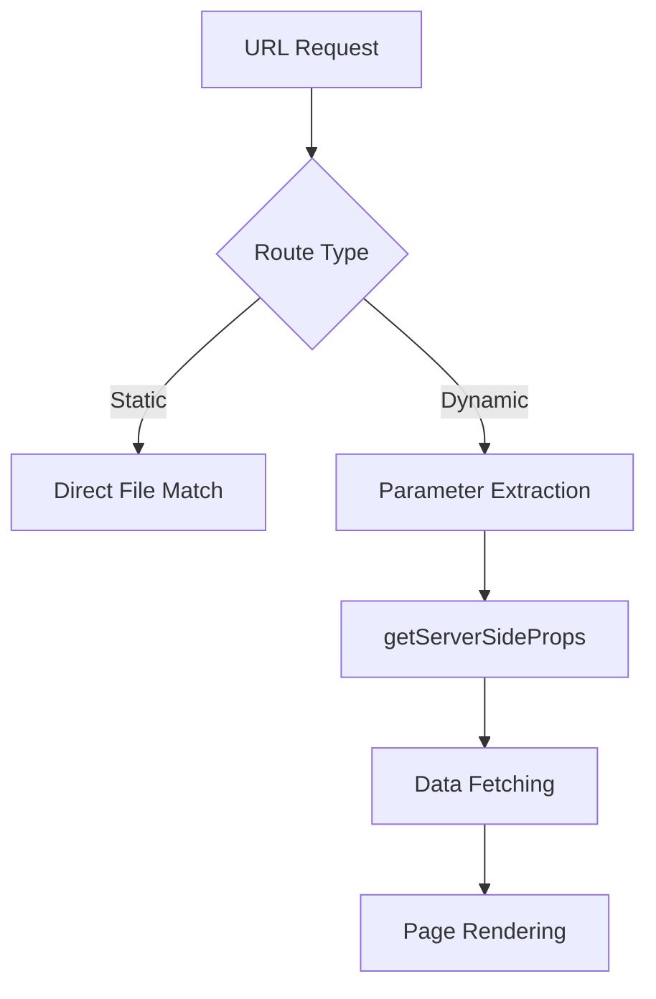
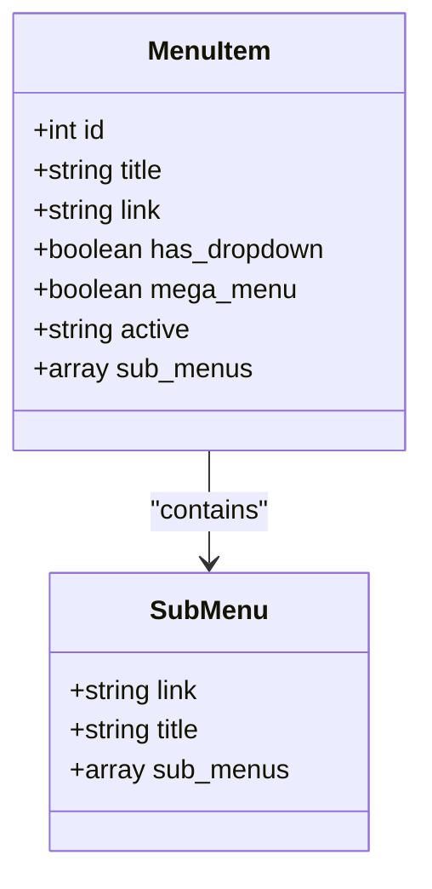
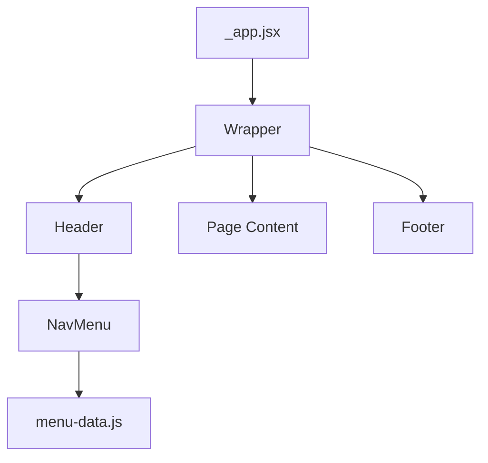

# Routing & Navigation

<cite>
**Referenced Files in This Document**   
- [menu-data.js](file://src/layout/headers/menu-data.js)
- [nav-menu.jsx](file://src/layout/headers/nav-menu.jsx)
- [\_app.jsx](file://src/pages/_app.jsx)
- [\_document.jsx](file://src/pages/_document.jsx)
- [\[service\].jsx](file://src/pages/services/[service].jsx)
- [\[project\].jsx](file://src/pages/project-details/[project].jsx)
- [header.jsx](file://src/layout/headers/header.jsx)
- [footer.jsx](file://src/layout/footers/footer.jsx)
</cite>

## Table of Contents
1. [Next.js File-Based Routing](#nextjs-file-based-routing)
2. [Dynamic Route Implementation](#dynamic-route-implementation)
3. [Navigation Data Structure](#navigation-data-structure)
4. [NavMenu Component Architecture](#navmenu-component-architecture)
5. [Layout Integration](#layout-integration)
6. [Client-Side Navigation and SEO](#client-side-navigation-and-seo)

## Next.js File-Based Routing

The application implements Next.js file-based routing through the `src/pages` directory, where each file corresponds to a route in the application. Static routes are created using standard file naming conventions, such as `about.jsx` for the `/about` route and `contact.jsx` for the `/contact` route. The routing system automatically generates routes based on the file structure, with `index.jsx` serving as the root route (`/`). This convention-based approach eliminates the need for manual route configuration and provides a clear mapping between files and URLs.

**Section sources**
- [about.jsx](file://src/pages/about.jsx)
- [contact.jsx](file://src/pages/contact.jsx)
- [index.jsx](file://src/pages/index.jsx)

## Dynamic Route Implementation

Dynamic routes are implemented using bracket notation in the filename, allowing for parameterized URLs. The application contains two primary dynamic route implementations: `[service].jsx` in the `services` directory and `[project].jsx` in the `project-details` directory. These routes capture URL parameters and pass them as props to the page components. The `getServerSideProps` function extracts parameters from the `params` object, enabling server-side rendering with dynamic data. This approach supports SEO-friendly URLs while maintaining dynamic content loading capabilities.



**Diagram sources**
- [\[service\].jsx](file://src/pages/services/[service].jsx)
- [\[project\].jsx](file://src/pages/project-details/[project].jsx)

**Section sources**
- [\[service\].jsx](file://src/pages/services/[service].jsx#L25-L36)
- [\[project\].jsx](file://src/pages/project-details/[project].jsx#L25-L36)

## Navigation Data Structure

The navigation system is driven by the `menu-data.js` file, which defines a structured data model for the application's menu hierarchy. The data structure consists of menu items with properties including `id`, `title`, `link`, `has_dropdown`, and `sub_menus`. Each menu item can have nested sub-menus, enabling multi-level navigation. The `mega_menu` property indicates whether a menu item should display a comprehensive dropdown with multiple columns of links. This centralized data approach allows for consistent navigation across different header variants and simplifies menu updates.



**Diagram sources**
- [menu-data.js](file://src/layout/headers/menu-data.js#L1-L195)

**Section sources**
- [menu-data.js](file://src/layout/headers/menu-data.js#L1-L195)

## NavMenu Component Architecture

The `NavMenu` component renders responsive navigation based on the `menu-data.js` structure, supporting both desktop and mobile implementations. On desktop, the component displays a horizontal navigation bar with dropdown menus for items that have the `has_dropdown` flag set to true. The mobile implementation integrates with the meanmenu library through the `Offcanvus` component, providing a hamburger menu that slides in from the side. The component uses Next.js `Link` for client-side navigation, ensuring smooth page transitions without full reloads.

```mermaid
sequenceDiagram
participant NavMenu
participant menu_data
participant Link
participant Browser
NavMenu->>menu_data : Load menu configuration
loop For each menu item
NavMenu->>NavMenu : Create li element
NavMenu->>Link : Render Link with href
alt Has dropdown
NavMenu->>NavMenu : Render submenu ul
loop For each sub-menu item
NavMenu->>Link : Render nested Link
end
end
end
Link->>Browser : Handle client-side navigation
```

**Diagram sources**
- [nav-menu.jsx](file://src/layout/headers/nav-menu.jsx#L4-L25)
- [menu-data.js](file://src/layout/headers/menu-data.js)

**Section sources**
- [nav-menu.jsx](file://src/layout/headers/nav-menu.jsx#L4-L25)
- [mobile-menus.jsx](file://src/layout/headers/mobile-menus.jsx)

## Layout Integration

The routing system integrates with layout components to maintain persistent headers and footers across page transitions. The `_app.jsx` file serves as the root component, wrapping all pages with the `Wrapper` component that includes header and footer elements. This ensures that navigation elements remain consistent while only the page content changes during client-side navigation. The header components (header.jsx, header-2.jsx, etc.) import and render the `NavMenu` component, creating a unified navigation experience across different page layouts.



**Diagram sources**
- [\_app.jsx](file://src/pages/_app.jsx)
- [wrapper.jsx](file://src/layout/wrapper.jsx)
- [header.jsx](file://src/layout/headers/header.jsx)

**Section sources**
- [\_app.jsx](file://src/pages/_app.jsx#L7-L11)
- [wrapper.jsx](file://src/layout/wrapper.jsx)
- [header.jsx](file://src/layout/headers/header.jsx)

## Client-Side Navigation and SEO

The application leverages Next.js `Link` component for client-side navigation, enabling fast page transitions without full browser reloads. This enhances user experience by reducing perceived load times and maintaining application state. The routing structure supports SEO optimization through semantic URLs and server-side rendering of dynamic content via `getServerSideProps`. Each dynamic page generates unique meta tags for title and description, improving search engine visibility. The combination of client-side navigation and server-rendered content provides both performance benefits and strong SEO characteristics.

**Section sources**
- [\[service\].jsx](file://src/pages/services/[service].jsx#L8-L15)
- [\[project\].jsx](file://src/pages/project-details/[project].jsx#L8-L15)
- [\_document.jsx](file://src/pages/_document.jsx#L4-L18)