# SEO & Accessibility

<cite>
**Referenced Files in This Document**  
- [seo.jsx](file://src/common/seo.jsx)
- [next.config.js](file://next.config.js)
- [answer-question-data.js](file://src/data/answer-question-data.js)
</cite>

## Comprehensive SEO Implementation

The Matrix website implements a comprehensive SEO strategy through a centralized SEO component that manages all metadata across the site. The SEO component in `seo.jsx` serves as the single source of truth for search engine optimization, handling meta tags, Open Graph data, Twitter cards, and structured JSON-LD for rich snippets.

### SEO Component Architecture

The SEO component accepts various props to generate dynamic metadata for different pages. Key parameters include:
- `pageTitle`: For setting the page title with automatic site title concatenation
- `description`: Custom meta description with fallback content
- `keywords`: SEO keywords for search engine indexing
- `image`: Social sharing image with automatic URL resolution
- `url`: Canonical URL construction based on environment variables
- `structuredData`: JSON-LD schema markup for rich snippets

**Diagram sources**
- [seo.jsx](file://src/common/seo.jsx#L2-L131)

**Section sources**
- [seo.jsx](file://src/common/seo.jsx#L2-L131)

### Dynamic Metadata Generation

The SEO component dynamically generates metadata based on page-specific props. The component constructs full titles by combining the page title with the site title, creates absolute URLs using the base URL from environment variables, and properly formats social media images. The component also handles robots meta tags with configurable noIndex and noFollow options.

For content-rich pages like service details and team profiles, the component receives specific props that tailor the metadata to the content. For example, service pages include detailed descriptions of specific IT solutions, while team member pages feature individual professional titles and expertise.

### Structured Data Implementation

The SEO component implements comprehensive JSON-LD structured data for rich snippets. It includes a default Organization schema with company information, contact details, and social profiles. Additionally, it supports page-specific structured data through the `structuredData` prop, allowing for custom schema markup on different page types.

Examples of schema markup implementation:
- **Service pages**: Use appropriate schema types to describe IT services and solutions
- **Team member pages**: Implement Person schema with professional details
- **Organization**: Comprehensive Organization schema with contact points, address, and social links

The structured data enhances search engine understanding of content, potentially leading to rich results with enhanced visual presentation in search engine results pages.

## Accessibility Features

The website implements several accessibility features to ensure compliance with web accessibility standards and provide an inclusive user experience.

### Semantic HTML and ARIA Implementation

The codebase utilizes semantic HTML elements and ARIA attributes to enhance accessibility. Key implementations include:
- Proper use of ARIA attributes like `aria-expanded`, `aria-controls`, and `aria-selected` in interactive components
- Semantic tab navigation with proper ARIA roles and attributes
- Accessible form controls with appropriate labels and error descriptions

The implementation of ARIA attributes in components like accordions and tab interfaces ensures that screen readers can properly interpret the state and relationships of interactive elements.

**Diagram sources**
- [answer-question.jsx](file://src/common/answer-question.jsx#L19-L29)
- [breadcrumb-5.jsx](file://src/common/breadcrumbs/breadcrumb-5.jsx#L66-L80)
- [nice-select.jsx](file://src/ui/nice-select.jsx#L45-L61)

**Section sources**
- [answer-question.jsx](file://src/common/answer-question.jsx#L19-L29)
- [breadcrumb-5.jsx](file://src/common/breadcrumbs/breadcrumb-5.jsx#L66-L80)
- [nice-select.jsx](file://src/ui/nice-select.jsx#L45-L61)

### Keyboard Navigation Support

The website supports keyboard navigation through proper focus management and interactive element implementation. Components are designed to be navigable using the tab key, with visible focus indicators. Interactive elements like buttons, links, and form controls are accessible via keyboard, and complex components like dropdowns and modals implement appropriate keyboard interaction patterns.

The NiceSelect component demonstrates keyboard accessibility with tabIndex attributes and key press event handlers, ensuring users can interact with custom select elements using only the keyboard.

## Technical SEO Configuration

The `next.config.js` file contains critical technical SEO configurations that enhance site performance, security, and search engine visibility.

### Security Headers

The configuration implements important security headers through the headers() function:
- `X-Frame-Options: DENY` - Prevents clickjacking attacks
- `X-Content-Type-Options: nosniff` - Prevents MIME type sniffing
- `Referrer-Policy: origin-when-cross-origin` - Controls referrer information
- `X-XSS-Protection: 1; mode=block` - Enables XSS filtering

These headers improve site security and trustworthiness, which are positive ranking factors for search engines.

### Redirects and URL Management

The configuration implements SEO-friendly redirects:
- Permanent redirect from `/home` to `/` to consolidate page authority
- Proper handling of URL variations to prevent duplicate content issues

### Image Optimization

The Next.js image optimization configuration enhances page performance and SEO:
- Support for modern image formats (WebP, AVIF)
- Defined device sizes for responsive images
- Image size optimization with specified dimensions
- Cache TTL configuration for optimal performance

```mermaid
graph TB
A[next.config.js] --> B[Security Headers]
A --> C[Redirects]
A --> D[Image Optimization]
A --> E[Performance Settings]
B --> F[X-Frame-Options]
B --> G[X-Content-Type-Options]
C --> H[/home → /]
D --> I[WebP, AVIF support]
D --> J[Responsive sizes]
E --> K[SWC minification]
E --> L[Remove console logs]
```

**Diagram sources**
- [next.config.js](file://next.config.js#L20-L57)

**Section sources**
- [next.config.js](file://next.config.js#L20-L102)

## SEO Integration Architecture

The SEO component is integrated throughout the application via the page wrapper structure. Each page component wraps its content with the Wrapper component, which in turn includes the SEO component. This ensures consistent metadata application across all pages while allowing for page-specific customization.

The integration pattern follows a hierarchical approach:
1. Base SEO defaults in the component
2. Page-specific overrides through props
3. Global application through the wrapper pattern

This architecture ensures that all pages have proper SEO metadata while allowing for necessary customization based on content type and purpose.

## Performance Metrics and SEO Impact

The SEO and accessibility implementations directly impact key performance metrics that influence search engine rankings:

- **Core Web Vitals**: Proper image optimization and code splitting contribute to better LCP, FID, and CLS scores
- **Page Speed**: Minified code, optimized images, and efficient asset loading improve load times
- **Mobile Friendliness**: Responsive design and touch-friendly elements enhance mobile experience
- **Security**: Implemented security headers improve site trustworthiness

These factors collectively contribute to improved search engine rankings and better user experience.

## Accessibility Testing Methodologies

While explicit accessibility testing code is not visible in the current analysis, the implementation suggests adherence to WCAG 2.1 AA principles through:
- Semantic HTML structure
- Proper contrast ratios (implied by design system)
- Keyboard navigability
- Screen reader support via ARIA attributes
- Responsive design for various devices

The presence of accessibility features in components indicates a commitment to inclusive design, though specific testing methodologies or automated accessibility checks are not evident in the current codebase analysis.