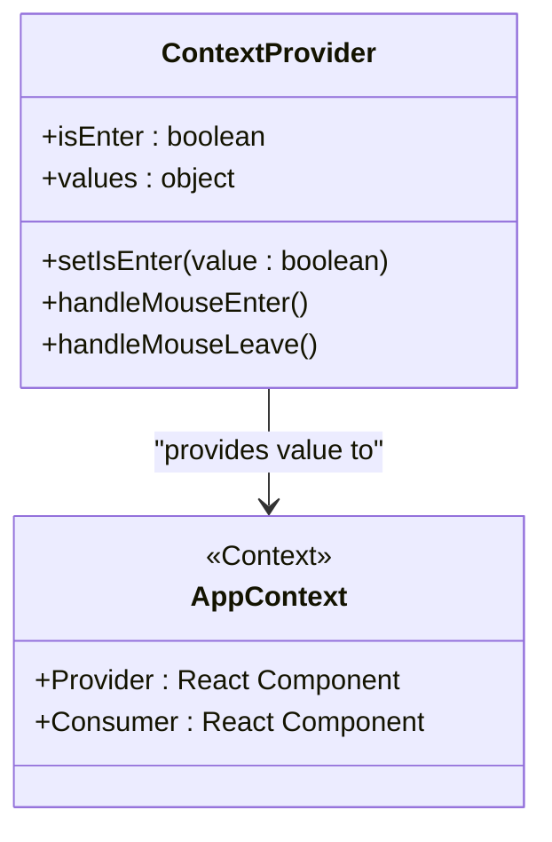

# Context API Usage

<cite>
**Referenced Files in This Document**   
- [ContextProvider.js](file://src/context/ContextProvider.js)
- [AnimateMouse.js](file://src/components/homes/home-5/AnimateMouse.js)
- [video-area.jsx](file://src/components/homes/home-5/video-area.jsx)
- [index.jsx](file://src/components/homes/home-5/index.jsx)
</cite>

## Table of Contents
1. [Introduction](#introduction)
2. [Context Provider Implementation](#context-provider-implementation)
3. [Global UI State Management](#global-ui-state-management)
4. [Component Integration Examples](#component-integration-examples)
5. [Performance Optimization and Best Practices](#performance-optimization-and-best-practices)
6. [Scalability and Architecture Considerations](#scalability-and-architecture-considerations)
7. [Troubleshooting Common Issues](#troubleshooting-common-issues)
8. [Conclusion](#conclusion)

## Introduction
The Matrix website leverages React Context API to manage global UI state efficiently, particularly for interactive hover-reveal animations. This document details how the `ContextProvider.js` file implements a provider pattern to share mouse interaction states across components without prop drilling. The context system enables dynamic visual feedback in response to user behavior, such as cursor movements and hover events, enhancing the overall user experience.

## Context Provider Implementation

The `ContextProvider` component initializes a global context using React’s `createContext()` and manages state via `useState`. It exposes state values and event handlers to all consumer components through the `AppContext.Provider`.



**Diagram sources**  
- [ContextProvider.js](file://src/context/ContextProvider.js#L2-L22)

**Section sources**  
- [ContextProvider.js](file://src/context/ContextProvider.js#L1-L25)

### Context Initialization
The `AppContext` is created at the module level and exported for use across the application. This allows any component to subscribe to the shared state.

```mermaid
flowchart TD
    Start([Context Initialization]) --> CreateContext["createContext()"]
    CreateContext --> DefineProvider["Define ContextProvider Component"]
    DefineProvider --> UseState["useState(false) for isEnter"]
    Use