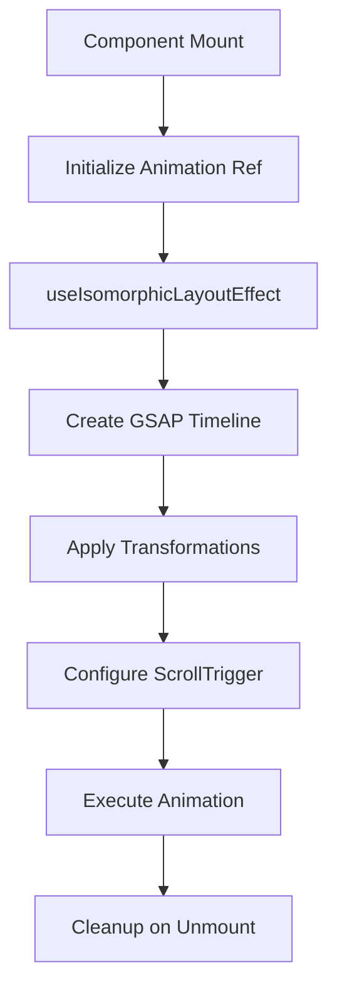

# State Management

<cite>
**Referenced Files in This Document**  
- [ContextProvider.js](file://src/context/ContextProvider.js)
- [use-sticky.js](file://src/hooks/use-sticky.js)
- [useTitleAnimation.js](file://src/hooks/useTitleAnimation.js)
- [useIsomorphicEffect.js](file://src/hooks/useIsomorphicEffect.js)
- [hero-banner.jsx](file://src/common/hero-banner.jsx)
- [useCharAnimation.js](file://src/hooks/useCharAnimation.js)
- [useMultipleAnime.js](file://src/hooks/useMultipleAnime.js)
</cite>

## Project Structure

The Matrix website implements a lightweight state management strategy centered around React's built-in features rather than external libraries like Redux. The state management system is organized into two primary directories:

- `src/context/`: Contains the global context provider for shared UI state
- `src/hooks/`: Houses custom hooks that encapsulate reusable stateful logic and side effects

This architecture follows React best practices by leveraging native React patterns for state management while maintaining separation of concerns between global application state and component-specific logic.

## Context API for Global UI State

The Matrix website utilizes React Context API through `ContextProvider.js` to manage global UI state, particularly for interactive elements that respond to user input across different components. The primary use case demonstrated in the codebase is handling mouse enter/leave events for hover effects.

The `ContextProvider` component creates a context (`AppContext`) that exposes three key values:
- `isEnter`: A boolean state tracking whether the mouse is currently hovering
- `handleMouseEnter`: Function to set `isEnter` to true
- `handleMouseLeave`: Function to set `isEnter` to false

This pattern allows any component in the application to subscribe to hover state changes without requiring prop drilling through intermediate components. Components can consume this context to implement hover-based animations, visual feedback, or interactive behaviors consistently across the site.

**Section sources**
- [ContextProvider.js](file://src/context/ContextProvider.js#L4-L22)

## Custom Hooks for Reusable Stateful Logic

The website implements several custom hooks in the `src/hooks/` directory to encapsulate reusable stateful logic and side effects, promoting code reusability and maintainability.

### useSticky Hook

The `useSticky` hook manages the state for sticky header functionality. It tracks scroll position and determines when the header should become fixed based on a threshold (200px scrollY). The hook properly cleans up event listeners in its cleanup function to prevent memory leaks, following React best practices for effect management.

### useTitleAnimation Hook

This hook integrates GSAP (GreenSock Animation Platform) with React to create sophisticated title animations. It uses animation references to target specific DOM elements and applies staggered animations with smooth easing functions. The hook is designed to be used with ScrollTrigger, enabling animations that activate when elements enter the viewport.

### useMultipleAnime Hook

The `useMultipleAnime` hook provides a reusable solution for animating multiple child elements with staggered effects. It uses GSAP to create sequential animations that trigger based on scroll position, with configurable delays based on data attributes. This enables consistent animation patterns across different sections of the website.

**Section sources**
- [use-sticky.js](file://src/hooks/use-sticky.js#L2-L20)
- [useTitleAnimation.js](file://src/hooks/useTitleAnimation.js#L3-L17)
- [useMultipleAnime.js](file://src/hooks/useMultipleAnime.js#L3-L25)

## Isomorphic Effect Pattern for SSR Safety

The website implements an isomorphic effect pattern through `useIsomorphicEffect.js` to ensure safe hydration in its Next.js environment. This custom hook conditionally uses `useLayoutEffect` on the client side and falls back to `useEffect` during server-side rendering.

This pattern addresses the common React hydration warning that occurs when using `useLayoutEffect` in SSR environments. By checking `typeof window !== 'undefined'`, the hook determines the execution environment and selects the appropriate effect hook. This ensures that layout effects that depend on browser APIs are only executed on the client, preventing hydration mismatches while maintaining the desired behavior during client-side rendering.

**Section sources**
- [useIsomorphicEffect.js](file://src/hooks/useIsomorphicEffect.js#L2-L3)

## Animation State Management with GSAP

Animation states are managed through a combination of React hooks and GSAP integration. The website employs several strategies for animation state management:

1. **Reference-based targeting**: Using `useRef` to maintain references to DOM elements that need animation
2. **Effect-driven animation**: Triggering animations within `useEffect` or `useIsomorphicLayoutEffect` hooks
3. **Scroll-triggered animations**: Utilizing GSAP's ScrollTrigger plugin to activate animations based on scroll position
4. **Staggered effects**: Implementing sequential animations with calculated delays for visual impact

The `useCharAnimation` hook demonstrates a specialized pattern for animating individual characters in text elements, applying transformations with specific easing functions and timing configurations. This creates engaging typographic animations that enhance the user experience.

**Diagram sources**
- [useTitleAnimation.js](file://src/hooks/useTitleAnimation.js#L3-L17)
- [useCharAnimation.js](file://src/hooks/useCharAnimation.js#L4-L10)

## Context Consumption in Components

Components consume the global context state through standard React context consumption patterns. For example, the `hero-banner.jsx` component demonstrates how context and hooks work together to create dynamic UI effects.

The hero banner implements parallax scrolling effects by tracking window scroll position in its local state and applying transform styles based on the scroll offset. While this particular component doesn't directly consume the `ContextProvider` state, it exemplifies the same principles of state management through hooks and effect handling.

Components that require hover state would use the `useContext(AppContext)` hook to access the `isEnter`, `handleMouseEnter`, and `handleMouseLeave` values, allowing them to respond to global hover events without maintaining their own state.

**Section sources**
- [hero-banner.jsx](file://src/common/hero-banner.jsx#L3-L36)

## Architecture Decision: Why Not Redux?

The Matrix website opts for React's built-in state management solutions rather than implementing Redux for several reasons:

1. **Application complexity**: The website appears to be primarily content-focused with UI interactions that can be effectively managed through context and hooks
2. **Bundle size considerations**: Avoiding Redux reduces bundle size, improving load performance
3. **Development simplicity**: The team can leverage familiar React patterns without introducing additional learning curves
4. **SSR compatibility**: Native React solutions integrate more seamlessly with Next.js server-side rendering

For applications of this scale and type, the overhead of Redux (middleware, store setup, action creators, reducers) would likely outweigh the benefits, especially when React Context and custom hooks can adequately address the state management requirements.

## Best Practices for Performance Optimization

The codebase demonstrates several best practices for avoiding unnecessary re-renders and optimizing performance:

1. **Proper effect cleanup**: All hooks with event listeners include cleanup functions to prevent memory leaks
2. **Stable dependencies**: Effect hooks use empty dependency arrays when appropriate, preventing unnecessary re-execution
3. **Memoized returns**: Custom hooks return stable objects to prevent downstream components from re-rendering
4. **Conditional effect execution**: The isomorphic effect pattern prevents client-only effects from running during SSR
5. **Efficient event handling**: Scroll and mouse event handlers are properly managed to avoid performance bottlenecks

These patterns ensure that the state management system remains performant even as the application scales, providing a smooth user experience across different devices and network conditions.