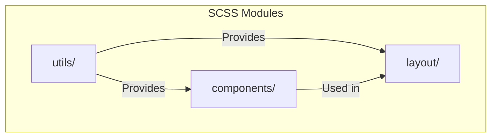
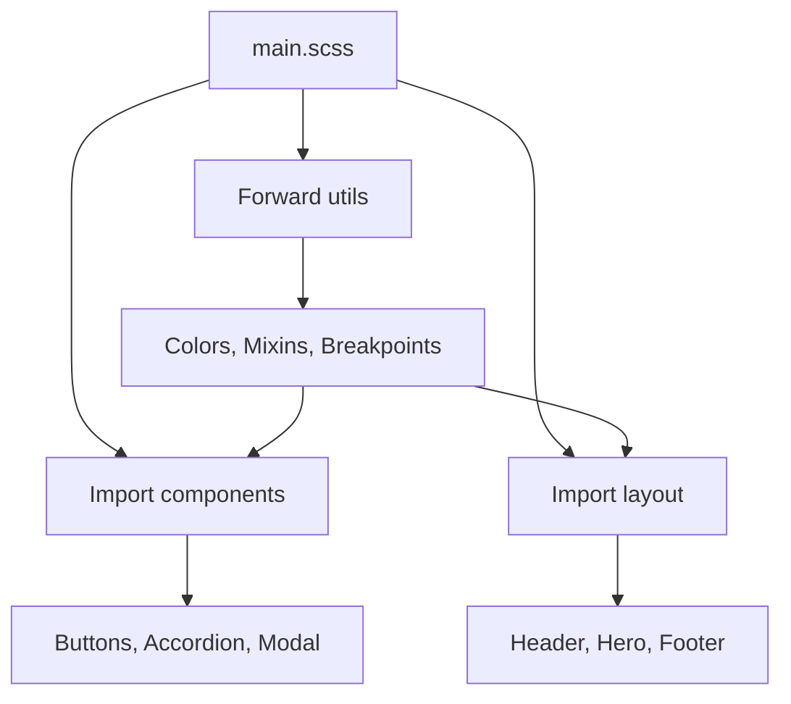
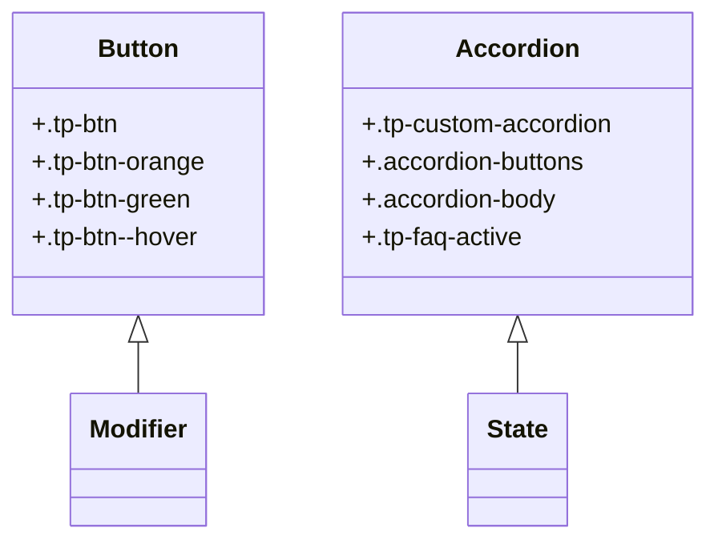
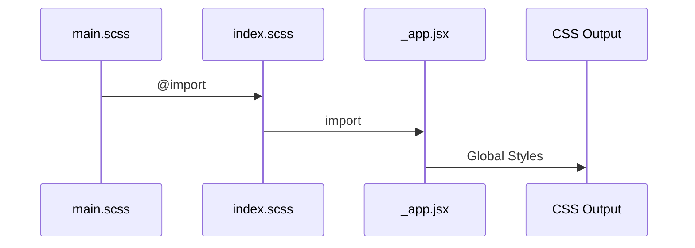

# SCSS Architecture

<cite>
**Referenced Files in This Document**   
- [main.scss](file://public/assets/scss/main.scss)
- [_buttons.scss](file://public/assets/scss/components/_buttons.scss)
- [_accordion.scss](file://public/assets/scss/components/_accordion.scss)
- [_index.scss](file://public/assets/scss/utils/_index.scss)
- [index.scss](file://src/styles/index.scss)
- [package.json](file://package.json)
- [_mixins.scss](file://public/assets/scss/utils/_mixins.scss)
</cite>

## Table of Contents
1. [SCSS Modular Structure](#scss-modular-structure)
2. [Directory Roles and Organization](#directory-roles-and-organization)
3. [Import Order and Compilation Pipeline](#import-order-and-compilation-pipeline)
4. [Component-Based SCSS and React Integration](#component-based-scss-and-react-integration)
5. [BEM-Like Naming Conventions](#bem-like-naming-conventions)
6. [SCSS to CSS Compilation and Next.js Integration](#scss-to-css-compilation-and-nextjs-integration)

## SCSS Modular Structure

The SCSS architecture in this project follows a modular, scalable structure designed for maintainability and consistency across the codebase. The system is organized into three primary directories—components, layout, and utils—each serving a distinct purpose in the styling ecosystem. This modular approach ensures separation of concerns, promotes reusability, and aligns closely with the component-based structure of the React application in the `src/components` directory.

**Section sources**
- [main.scss](file://public/assets/scss/main.scss#L1-L49)

## Directory Roles and Organization

### Components Directory
The `components` directory contains SCSS partials for reusable UI elements such as buttons, accordions, modals, and tabs. Each component is self-contained and designed for reuse across different pages and layouts. Examples include `_buttons.scss` for all button variants and `_accordion.scss` for collapsible content sections.

### Layout Directory
The `layout` directory houses SCSS files specific to page-level styling, such as `_header.scss`, `_hero.scss`, and `_footer.scss`. These styles are scoped to particular sections of the application and reflect the structure of individual pages like about, blog, and contact.

### Utils Directory
The `utils` directory provides global SCSS utilities including variables, mixins, breakpoints, and typography settings. It includes `_colors.scss` for color definitions, `_mixins.scss` for reusable style patterns, and `_breakpoints.scss` for responsive design. The `_index.scss` file in this directory aggregates all utilities using `@forward` directives for centralized access.

**Diagram sources**
- [utils/_index.scss](file://public/assets/scss/utils/_index.scss#L1-L5)
- [components/_buttons.scss](file://public/assets/scss/components/_buttons.scss#L1-L2)

**Section sources**
- [components/_buttons.scss](file://public/assets/scss/components/_buttons.scss#L1-L793)
- [components/_accordion.scss](file://public/assets/scss/components/_accordion.scss#L1-L180)
- [utils/_index.scss](file://public/assets/scss/utils/_index.scss#L1-L5)

## Import Order and Compilation Pipeline

The `main.scss` file orchestrates the entire SCSS compilation process by importing all partials in a specific order to ensure proper cascade and specificity. It begins by forwarding third-party CSS libraries such as `meanmenu.css` and `animate.css`, followed by component and layout styles. The import sequence ensures that utility styles are available to all components and that layout styles override component defaults when necessary.

**Diagram sources**
- [main.scss](file://public/assets/scss/main.scss#L1-L49)

**Section sources**
- [main.scss](file://public/assets/scss/main.scss#L1-L49)

## Component-Based SCSS and React Integration

The SCSS component structure directly mirrors the React component organization found in `src/components`. For example, the `_buttons.scss` file corresponds to button components used across various React UI elements, while `_accordion.scss` styles map to accordion components in the React codebase. This parallel structure simplifies development and ensures consistent styling behavior across the application.

**Section sources**
- [components/_buttons.scss](file://public/assets/scss/components/_buttons.scss#L1-L793)
- [components/_accordion.scss](file://public/assets/scss/components/_accordion.scss#L1-L180)
- [src/components](file://src/components)

## BEM-Like Naming Conventions

The SCSS codebase employs BEM-like naming conventions to ensure clarity and avoid style conflicts. Selectors such as `.tp-btn` (block), `.tp-btn--primary` (modifier), and `.tp-btn__text` (element) follow a structured pattern that enhances readability and maintainability. In `_buttons.scss`, modifier classes like `.tp-btn-orange` and `.tp-btn-green` extend base button styles with specific visual treatments.

Similarly, `_accordion.scss` uses `.tp-custom-accordion` as the block, with `.accordion-buttons` and `.accordion-body` as elements, and `.tp-faq-active` as a modifier to indicate expanded state. This approach enables predictable styling and facilitates easy overrides.

**Diagram sources**
- [components/_buttons.scss](file://public/assets/scss/components/_buttons.scss#L1-L793)
- [components/_accordion.scss](file://public/assets/scss/components/_accordion.scss#L1-L180)

**Section sources**
- [components/_buttons.scss](file://public/assets/scss/components/_buttons.scss#L1-L793)
- [components/_accordion.scss](file://public/assets/scss/components/_accordion.scss#L1-L180)

## SCSS to CSS Compilation and Next.js Integration

The SCSS compilation pipeline is managed via the `sass` package listed in `package.json`. The `main.scss` file is compiled into CSS and imported into the Next.js application through `src/styles/index.scss`, which serves as the global stylesheet entry point. This file also includes external library styles such as Bootstrap and Swiper.

The `index.scss` file is imported in `_app.jsx`, ensuring that all styles are globally available across the application. The build process leverages Next.js’s built-in support for SCSS, enabling seamless integration without additional configuration.

**Diagram sources**
- [main.scss](file://public/assets/scss/main.scss#L1-L49)
- [index.scss](file://src/styles/index.scss#L1-L6)
- [_app.jsx](file://src/pages/_app.jsx#L1-L10)

**Section sources**
- [main.scss](file://public/assets/scss/main.scss#L1-L49)
- [index.scss](file://src/styles/index.scss#L1-L6)
- [package.json](file://package.json#L1-L76)
- [_app.jsx](file://src/pages/_app.jsx#L1-L10)