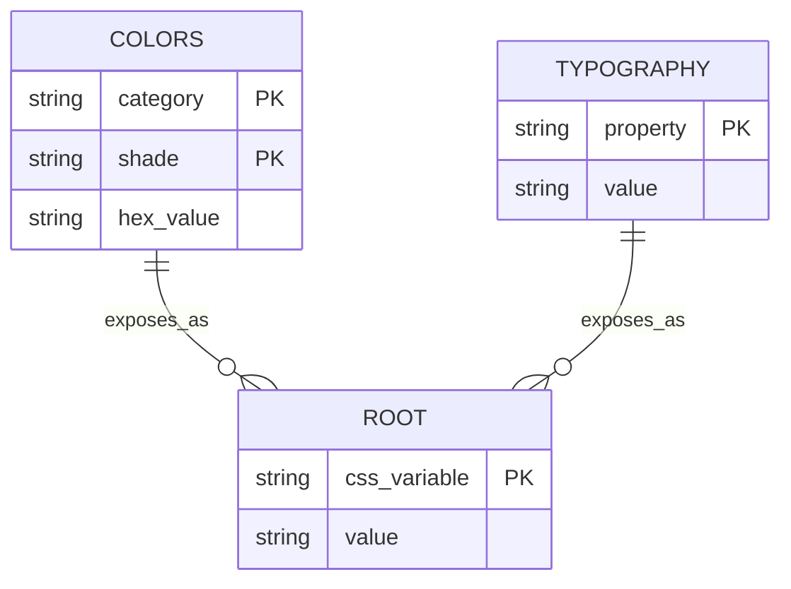
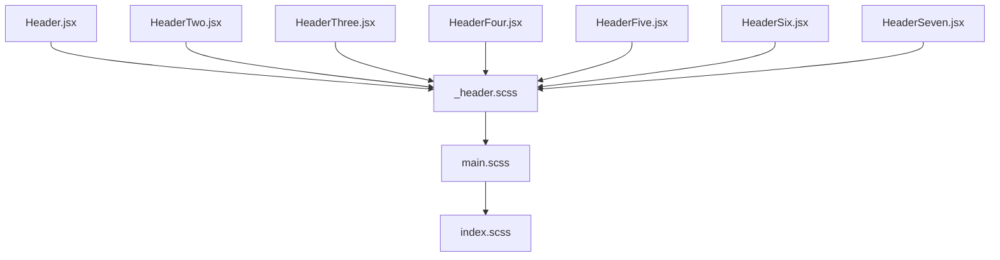
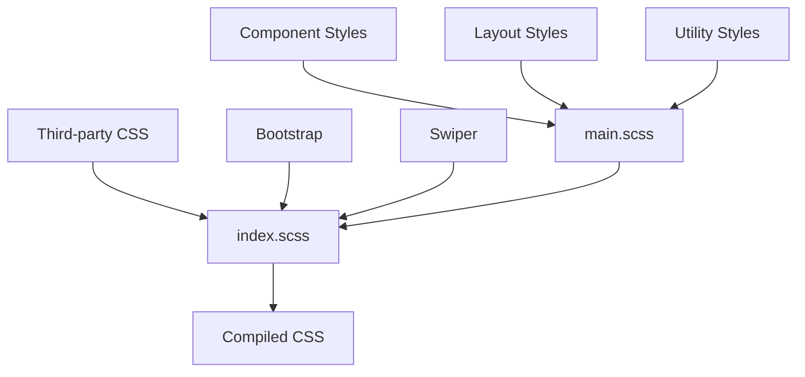

# Styling Strategy

<cite>
**Referenced Files in This Document**   
- [main.scss](file://public/assets/scss/main.scss)
- [index.scss](file://src/styles/index.scss)
- [_colors.scss](file://public/assets/scss/utils/_colors.scss)
- [_typography.scss](file://public/assets/scss/utils/_typography.scss)
- [_mixins.scss](file://public/assets/scss/utils/_mixins.scss)
- [_breakpoints.scss](file://public/assets/scss/utils/_breakpoints.scss)
- [_buttons.scss](file://public/assets/scss/components/_buttons.scss)
- [_header.scss](file://public/assets/scss/layout/_header.scss)
- [_hero.scss](file://public/assets/scss/layout/_hero.scss)
- [_theme.scss](file://public/assets/scss/components/_theme.scss)
- [_root.scss](file://public/assets/scss/utils/_root.scss)
</cite>

## Table of Contents
1. [Modular SCSS Architecture](#modular-scss-architecture)
2. [Utility-First Approach](#utility-first-approach)
3. [Theme and Color System](#theme-and-color-system)
4. [Responsive Design with Mixins](#responsive-design-with-mixins)
5. [Component-Style Mapping](#component-style-mapping)
6. [Compilation Process](#compilation-process)
7. [Class Naming Conventions](#class-naming-conventions)

## Modular SCSS Architecture

The SCSS styling architecture follows a modular structure organized into three main directories: components, layout, and utils. The main.scss file serves as the entry point that aggregates all SCSS modules through @forward directives. The components directory contains reusable UI elements like buttons, modals, and carousels, while the layout directory houses page-specific styles corresponding to major sections such as header, hero, and footer. The utils directory provides foundational styling resources including color variables, typography settings, and mixins. This modular approach enables maintainable and scalable styling by separating concerns and promoting reusability across the application.

**Section sources**
- [main.scss](file://public/assets/scss/main.scss#L1-L48)
- [_theme.scss](file://public/assets/scss/components/_theme.scss#L1-L347)

## Utility-First Approach

The styling system implements a utility-first approach with specialized CSS files for spacing and typography. The spacing.css file provides utility classes for consistent margin and padding application across components. Typography variables are defined in _typography.scss, which establishes font families and imports external fonts through a centralized $font-url variable. These typography variables are organized in a map structure under $font-family, defining body, heading, and specialized font stacks. This utility-first methodology ensures typographic consistency and simplifies spacing implementation, allowing developers to apply styles predictably without writing custom CSS for common formatting needs.

**Section sources**
- [spacing.css](file://public/assets/css/spacing.css)
- [_typography.scss](file://public/assets/scss/utils/_typography.scss#L1-L15)
- [main.scss](file://public/assets/scss/main.scss#L1-L5)

## Theme and Color System

The theme system is implemented through a comprehensive color architecture that enables consistent branding across the application. Color variables are defined in _colors.scss using a nested map structure organized by color categories such as common, heading, grey, text, theme, and border. These color variables are then exposed as CSS custom properties in :root through _root.scss, which imports both _colors.scss and _typography.scss. This approach allows for dynamic theme switching and ensures color consistency by centralizing all color definitions. The theme variables (theme-1 through theme-4) provide a palette for accent colors that can be easily modified to adapt the site's visual identity without changing individual component styles.

**Diagram sources**
- [_colors.scss](file://public/assets/scss/utils/_colors.scss#L1-L46)
- [_typography.scss](file://public/assets/scss/utils/_typography.scss#L1-L15)
- [_root.scss](file://public/assets/scss/utils/_root.scss#L1-L23)

## Responsive Design with Mixins

Responsive design is facilitated through a comprehensive set of mixins defined in _mixins.scss and breakpoint variables in _breakpoints.scss. The mixin library includes utilities for common CSS patterns such as transitions, transforms, box shadows, and flexbox layouts. Responsive breakpoints are defined as media query strings for various screen sizes (xxxl, xxl, xl, lg, md, sm, xs), enabling consistent responsive behavior across components. These breakpoints are used throughout the codebase with the @media directive to create adaptive layouts. The mixin system promotes code reuse and ensures consistent implementation of complex CSS features like animations and gradients across different components.

**Section sources**
- [_mixins.scss](file://public/assets/scss/utils/_mixins.scss#L1-L247)
- [_breakpoints.scss](file://public/assets/scss/utils/_breakpoints.scss#L1-L13)

## Component-Style Mapping

Component-specific SCSS files in public/assets/scss/layout directly correspond to React components in the application. For example, _header.scss contains styles for header-related components, while _hero.scss styles the hero section components. This one-to-one mapping between SCSS layout files and React components creates a clear relationship between styling and functionality. The header component demonstrates this relationship, with multiple header variants (header-2 through header-7) sharing common styling patterns defined in _header.scss while implementing specific visual treatments. This approach enables targeted styling while maintaining design consistency across different component instances.

**Diagram sources**
- [_header.scss](file://public/assets/scss/layout/_header.scss#L1-L799)
- [header.jsx](file://src/layout/headers/header.jsx#L17-L107)
- [header-2.jsx](file://src/layout/headers/header-2.jsx#L10-L49)
- [header-3.jsx](file://src/layout/headers/header-3.jsx#L10-L53)
- [header-4.jsx](file://src/layout/headers/header-4.jsx#L11-L65)
- [header-5.jsx](file://src/layout/headers/header-5.jsx#L9-L53)
- [header-6.jsx](file://src/layout/headers/header-6.jsx#L13-L64)
- [header-7.jsx](file://src/layout/headers/header-7.jsx#L9-L68)

## Compilation Process

The SCSS compilation process follows a hierarchical import structure that begins with index.scss in the src/styles directory. This file imports third-party CSS libraries, Bootstrap, Swiper, and ultimately main.scss from the public assets. The main.scss file aggregates all component and layout styles through @forward directives, creating a single compiled CSS output. This compilation pipeline ensures that utility styles, component styles, and layout styles are processed in the correct order, with foundational utilities processed before component-specific styles. The use of @forward instead of @import in main.scss provides better performance by eliminating duplicate CSS and enabling tree-shaking of unused styles.

**Diagram sources**
- [index.scss](file://src/styles/index.scss#L1-L6)
- [main.scss](file://public/assets/scss/main.scss#L1-L48)

## Class Naming Conventions

The codebase employs a consistent class naming convention that follows a BEM-like pattern with component prefixes. Classes are prefixed with "tp-" to identify them as part of the theme (e.g., tp-btn, tp-hero). Modifier classes extend base components with variations (e.g., tp-btn-white, tp-btn-green-sm). This naming convention creates a clear hierarchy and prevents style conflicts. The component classes are semantic and descriptive, making it easy to understand their purpose from the class name alone. For example, header-bottom__main-menu indicates a main menu within the bottom section of the header, following a block__element pattern with optional modifiers.

**Section sources**
- [_buttons.scss](file://public/assets/scss/components/_buttons.scss#L1-L792)
- [_header.scss](file://public/assets/scss/layout/_header.scss#L1-L799)
- [_hero.scss](file://public/assets/scss/layout/_hero.scss#L1-L799)